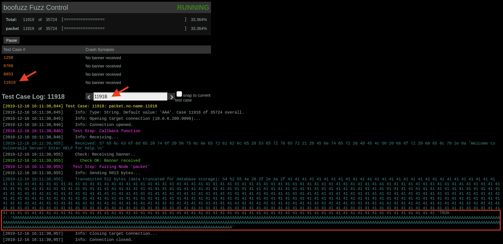

---

layout: single
title: "Exploiting Vulnserver Part 1 - TRUN"
subtitle: "Test"
tags: [Exploitation, OSCE]
toc: true
toc_label: "Contents"
toc_icon: "cog"
header:
  overlay_image: /assets/images/post-default-cover.jpg
---

Today I'm going to be running over some exploitation techniques using a piece of software created by Stephen Bradshaw called Vulnserver. As it's name suggests, it's preceily that, a small TCP socket application that contains various coding vulnerabilities in some of its functions.

> Vulnserver is a multithreaded Windows based TCP server that listens for client connections on port 9999 (by default) and allows the user to run a number of different commands that are vulnerable to various types of exploitable buffer overflows.

You can grab a copy of Vulnserver [here](https://github.com/stephenbradshaw/vulnserver)

Instead of jumping right into the exploitation aspects, I'm going to spend some time to present the whole process. So from examining the application, to fuzzing and finally exploitation.

I'll also go into further details on how to exploit this multiple ways based on certain scenarios, hopefully that makes a good learning execrise for both of us :)

Please checkout the following excellent resources if this is all totally new to you:

[Intro to x86 Assembly](https://www.securitysift.com/windows-exploit-development-part-1-basics/)

[Windows Exploit Writing Tutorial - Stack Based Overflows](https://www.corelan.be/index.php/2009/07/19/exploit-writing-tutorial-part-1-stack-based-overflows/)

[Windows Exploit Development Basics](https://www.securitysift.com/windows-exploit-development-part-1-basics/)

# Methodology

This is the rough outline of the methodology I'll be using when testing Vulnserver.

## Application Analysis

This is the poking and prodding of the application and is important when you get to the fuzzing stage. We'll be looking at how the application works, its functions, what commands it supports and where user input is accepted.

## Fuzzing

For this we'll be using [boofuzz](https://boofuzz.readthedocs.io/en/latest/) which is essentially the successor to **sulley**. It is a fuzzing framework written in python. After examining the application you should have a good idea of how it works and any user input supplied to commands. This will feed into configuring your fuzzing scripts later. 

Fuzzing is essentially the process of sending large amounts of arbitrary input to the application and examining how it behaves, more importantly in our case, looking for arbitrary input that causes the application to crash.

## Crash Analysis

At this point we'll be examining the crash to ascertain how we can leverage this to obtain code execution. Here you will spend a lot of your time inside a debugger. The debugger of choice of we'll be using is [Immunity Debugger](https://www.immunityinc.com/products/debugger/). Immunity Debugger is a fork of Olly Debugger, but it supports python scripting and is tailored a bit more towards exploit development. 

- Lightweight
- Tailored for exploit development
- Supports python

We'll also be making use of [mona](https://github.com/corelan/mona) by corelanc0d3r. You can view the manual [here](https://www.corelan.be/index.php/2011/07/14/mona-py-the-manual/)

Mona provides additional functionality that will assist with expoit development such as locating patterns in memory and registers, offsets, assisting with bad character identification and a whole heap of other things I'm still yet to explore.

In working out how we can leverage the crash, we'll be looking for:

1. Do we have control of **EIP**?
2. What registers do we control?
3. How much space do we have to work with?
4. Have we overwritten the **SEH Chain**

## Bad Character Identification

Essentially when your sending code to an application certain characters have special significance. For example, `x00` is a null byte and denotes a string terminator. Sending this will prematurely end your shellcode. The line feed (new line) character and carriege return `x0a` and `x0d` are also commonly bad characters.

The general method for identifying bad characters is sending a block of all possible characters, so `x01 - xff` then examining the stack and looking for any characters which have become corrupt or truncations in our original character block. Rinse and repeat. Although this can become a bit trickier when you have limited space to work with.

> You can use `man ascii` to check the ASCII character set

I will say this is a *critical* step so it pays to triple check your characters here to save you from pulling your hair out later on when things don't seem to work as they should.

## Exploitation

Here is where the fun begins. We'll be putting what we learned from analysing the crash into action and debugging the applications execution flow to ensure we can take control and have our own code executed.

1. Confirm we can reach our code
2. Generating shellcode
3. Testing our PoC exploit

# Environment Setup

If you want to follow along, you'll need to setup and install the following.

## Target Machine

- A Windows XP or Windows 7 VM (I'm using Windows 7 Pro x64)
- You may need to adjust the firewall to permit access to your application for testing

**Tooling**

- Install Python 2.7
- Install Immunity Debugger
- Add `mona.py` into the PyCommands folder (`C:\Program Files\Immunity Inc\Immunity Debugger\PyCommands`)

## Exploit Dev Machine

- Linux distribution (I'm using Kali Linux)

**Tooling**

- Metasploit Framework (`apt install metasploit-framework`)

  - `msfvenom`

  - `msf-pattern_create` / `msf-pattern_offset`

    `msf-metasm_shell`

- Python 2.7 or 3.6 (`apt install python`)

- Boofuzz (`pip install boofuzz`)

# Application Analysis

So let's launch `vulnserver.exe` and see how it behaves.

**Launching Vulnserver**


We use `nc` to connect and are greeted with a welcome banner:

```console
C:\Users\WIN7\Desktop>nc -t 127.0.0.1 9999

Welcome to Vulnerable Server! Enter HELP for help.

HELP
Valid Commands:
HELP
STATS [stat_value]
RTIME [rtime_value]
LTIME [ltime_value]
SRUN [srun_value]
TRUN [trun_value]
GMON [gmon_value]
GDOG [gdog_value]
KSTET [kstet_value]
GTER [gter_value]
HTER [hter_value]
LTER [lter_value]
KSTAN [lstan_value]
EXIT

STATS 1
STATS VALUE NORMAL			
STATS 22
STATS VALUE NORMAL
RTIME 22
RTIME VALUE WITHIN LIMITS
RTIME 2000000000
RTIME VALUE WITHIN LIMITS
TRUN 22
TRUN COMPLETE
TRUN TEST
TRUN COMPLETE
TRUN 20000000000
TRUN COMPLETE
GMON
UNKNOWN COMMAND
GMON 22
GMON STARTED
GMON 20000000000
GMON STARTED
STATS
UNKNOWN COMMAND
STATS 123456
STATS VALUE NORMAL
KSTET 200000000
KSTET SUCCESSFUL
KSTET TEST2020
KSTET SUCCESSFUL
KSTET ?
KSTET SUCCESSFUL
EXIT
GOODBYE
```

So we can see vulnserver.exe binds to TCP port 9999 and listens for a connection. Connecting to the server using netcat and entering `HELP` vulnserver.exe shows us all the commands it supports.

Testing a few of them shows that they all seem to take some input and don't seem to be concerned whether input is a string or an integer. Also, no output is presented back to the user with the exception of the "UNKNOWN COMMAND" string.

So as you can see if we were to attempt supplying arbitrary input to all these commands it would be quiet time consuming. You could write some shell or python script to automate the process but there are much more elegant solutions available that can do this for us as we'll see next.

# Fuzzing

Let's use **boofuzz** to do the hard work for us. Searching online you'll find a couple of good guides on setting up boofuzz, one that I found really helpful is written by [Zero Aptitude](https://zeroaptitude.com/zerodetail/fuzzing-with-boofuzz/).

Check that out for the basic structure on how boofuzz works. 

Given that there are 12 commands and we do not know which if any of them are vulnerable at this point, I'll be using a feature of boofuzz called `s_groups()` that will allow us to step through a list of static values. So each value will represent each command above.

Another nice feature of boofuzz is the process monitor. This is another python script that is run on the target machine (like an agent) and monitors the process. Your boofuzz script needs to be configured to communicate with the process monitor, but it will identify when the application/process crashes or becomes unresponsive and let you know which specific test case resulted in the crash.

I'll touch on process monitor setup in a future post. If you are unable to install anything on the target machine, you can use `callbacks` to achieve a similar thing and thats what I'll be using here.

A callback is basically executed in-between requests and can be used as banner checker, so we give it the banner recieved upon connecting to the server and configure our script to check for this banner after each request. When the banner is not received we print and error and cease further testing.

Boofuzz by default logs to an SQLlite database. You can however configure it to log to a CSV if that is preferred, but I'm fine with the defaults and using DB Browser to analyse results.

#### Begin Fuzzing

Below is our script I've called `tcp-fuzz-sgroup-cb.py`. 

```python
#!/usr/bin/env python

from boofuzz import *
import argparse
import sys

# Make a list of the target commands
commands = ['STATS','RTIME','LTIME','SRUN','TRUN','GMON','GDOG','KSTET','GTER','HTER','LTER','KSTAN']

parser = argparse.ArgumentParser(description='Boofuzz Script')
parser.add_argument('-t', '--target', help='Target to fuzz')
parser.add_argument('-p', '--port', default=80, help='Target port, default 80', nargs='?', const=int)
parser.add_argument('-f', '--filename', help='Session filename')
parser.add_argument('-s', '--skip', default=0, help='Tests to skip', nargs='?', const=int)

args = parser.parse_args()

host = args.target
port = args.port
sessFile = args.filename
skipTests = args.skip

# Quick sanity check for args
if len(sys.argv) < 3:
        print "[-] Too few arguments.  Run with -h"
        sys.exit()

# Create a session, create a target
session = Session(
        session_filename=sessFile,          # Session filename (saving boofuzz session data)
        console_gui=1,                      # Enable curses GUI 
        restart_sleep_time=1,               # Time to wait after application restart
        )
target = Target(connection = SocketConnection(host, int(port), proto='tcp'))


def get_banner(target, ifuzz_logger, session, *args, **kwargs):
    banner_template = "Welcome to Vulnerable Server! Enter HELP for help."
    try:
        banner = target.recv(10000)    				# Grab banner
    except:
        print "Unable to connect. Target is down. Exiting." 	# If can't connect, exit
        exit(1)
 
    ifuzz_logger.log_check('Receiving banner..')  		# Log check
    if banner_template in banner:   				# Check if banner matches
        ifuzz_logger.log_pass('Banner received')  		# If match, log success
    else:
        ifuzz_logger.log_fail('No banner received') 		# Else, No banner
        print "No banner received.."
        exit(1)

# Initialize a request
s_initialize("packet")

# Create a group called 'verbs' using the 'commands' list
s_group("verbs", commands)    

# Create a block for use with groups
if s_block_start("packet", group="verbs"):
  s_delim(" ",fuzzable=0)
  s_string("AAA")
  s_string("\r\n")
s_block_end("packet")

# Connect and prep the request
# Start the fuzzing
session.add_target(target)
session.connect(s_get("packet"), callback=get_banner)
session.fuzz()
```


Save that to a file on your dev machine (be sure to `chmod +x`), then open Immunty Debugger and attach it to vulnserver.exe on the target:

1. Open Immunity Debugger
2. File > Attach > Browse to vulnserver.exe

Now when you attach a debugger to a process it will start in a paused state, so hit `F9` to run it.


> Immunity Debugger - Shortcuts (MacOs)
>
> | Key            | Description                              |
> | :------------- | :--------------------------------------- |
> | Fn + F9        | Run program                              |
> | Fn + Ctrl + F2 | Restart program                          |
> | Opt + C        | CPU pane                                 |
> | Opt + M        | Memory map pane                          |
> | Opt + E        | Modules pane                             |
> | Fn + F7        | Step-into                                |
> | Enter          | Follow instruction in dissassembler      |
> | -              | Return from instruction in dissassembler |
>


From your exploit dev machine start the fuzzer:

```console
./tcp-fuzz-sgroup.py -t 10.6.6.200 -p 9999 -f win7-session.log
```

You'll be greeted with the curses interface (which can be disabled by setting "console_gui=0" in the Session initiation) as boofuzz gets to work running through its test cases.

There are 35,724 test cases by default so multiply that by 12 for each command, so it will take some time as boofuzz works through them.

Another thing to note is boofuzz also has a web interface you can access to monitor its progress by navigating to `http://localhost:26000`.

**Boofuzz Web Interface**


After sometime, boofuzz will make its way through to the TRUN command and the vulnserver.exe application will eventually crash.



We can see from console that test case #11919 caused the "No banner recieved" error. So most likely whatever happed before this test case caused the application to no longer respond with its welcome banner.

Un-checking "snap to current test case" and click the left arrow to view the previous test case we can see that a 5013 byte string was sent to the TRUN command:

```
TRUN /.:/AAAAAAAAAAAAAAAAAAAAAAAAAAAAAAAAAAAAAAAAAAAAAA[TRUNCATED]
```

Next we examine the debugger, down the bottom you'll notice this:


It's crashed trying to execute `0x41414141` which is the hex representation of `AAAA`

Looking at the registers we can see **EIP** was overwritten with `AAAA`


So it looks like we have a stack based overflow where our arbitrary input has overwritten the stack and whatever instructions were there are now `x41's` or `A's`. So when EIP attempts to execute what instructions were once located there it instead tries to access the memory location 0x41414141, hence the access violation.

# Crash Analysis

So a few things to notice about this crash:

- We have control over EIP so theorectically can control application execution flow
- A string of "A" characters are present in the EAX register
- ESP also points to *some* portion of the string
- EBP which denotes the bottom of the stack frame has also been overwritten
- Structured Exception Handler (SEH) chain is intact, so we have not overwritten far enough to overwrite it.

Let's now confirm these observations.

## Exploit PoC

We will create a basic exploit skeleton in python to use for testing. 

**TCP Exploit Skeleton**

```python
#!/usr/bin/env python

import socket
import os
import sys
import argparse
from struct import pack

parser = argparse.ArgumentParser(description='Exploit PoC')
parser.add_argument('-t', '--target', help='Specify the target host')
parser.add_argument('-p', '--port', default=9999, help='Specify the target port. Default is 9999', nargs='?', const=int)

args = parser.parse_args()

if len(sys.argv) < 2:
    print "[-] Too few arguments.  Run with -h"
    sys.exit()

host = args.target
port = args.port
    
buflen = ""
eip = ""
seh = ""
nseh = ""

shellcode = ""

buf = ""

try:
    print "[+] Sending payload\r\n"
    s1 = socket.socket(socket.AF_INET, socket.SOCK_STREAM)
    s1.connect((host,port))
    s1.recv(1024)
    s1.send("LTER ." + buffer)
    s1.close()
    print "[+] Payload delivered"

except:
    print "[!] Connection failed, check debugger!"

```


| Line  | Comment                                                      |
| ----- | ------------------------------------------------------------ |
| 3-7   | We'll be using TCP sockets for our connection so we import `socket`. We'll also be using `pack` from `struct` so we do not need to worry about writing memory addressing in reverse to accomodate for little-endian etc. |
| 9-11  | Defining the script arguments for host and target            |
| 22-25 | These are just placeholder empty variables for now           |
| 31    | Try to initiate a connection, if it fails, print out connect failed |
| 33-37 | Actual socket initiation                                     |

## Crash Buffer Tweaking

How much buffer to send?

## Examining Space

Where and what parts of memory do I control?


# Bad Character Identification


# Exploitation


# Extras


## Scenario 1: Limited Space - Pre-shellcode

## Scenario 2: Limited Space - Egghunter

## Scenario 3: SEH Overwrite


